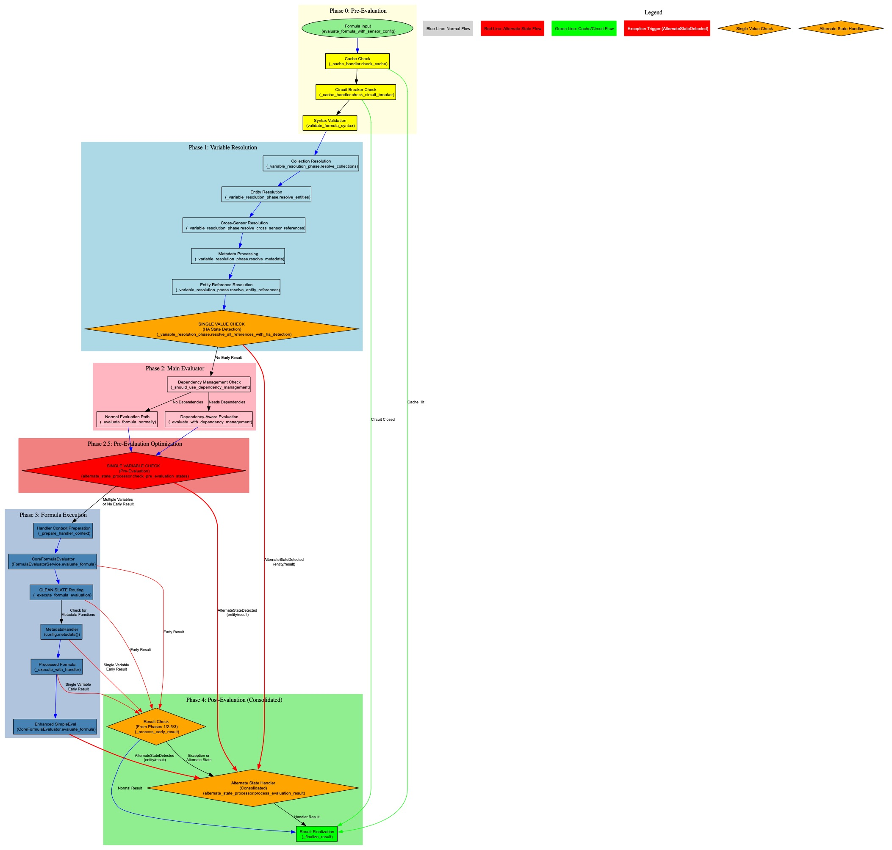

# HA Synthetic Sensors Architecture Overview

## Introduction

The HA Synthetic Sensors system implements a layered architecture for creating and managing synthetic sensors in Home Assistant.
This architecture follows compiler-like design principles with clear separation of concerns, enabling extensible formula
evaluation, robust dependency management, and type-safe entity reference handling.

## Architectural Design

### Layered Design

The system is organized into distinct layers, each with specific responsibilities:

- **Configuration Layer**: Handles YAML parsing, validation, and sensor definition management
- **Evaluation Layer**: Multi-phase formula evaluation with variable resolution and handler routing
- **Storage Layer**: Manages persistence, CRUD operations, and YAML export/import
- **Integration Layer**: Provides Home Assistant integration and entity management

### Evaluator Architecture

The evaluation system implements a **layered evaluator architecture** with clear separation of concerns:

#### Evaluator (`evaluator.py`)

**High-level orchestrator** that manages the entire evaluation pipeline:

- **Multi-Phase Coordination**: Orchestrates 5 distinct evaluation phases in strict order
- **Dependency Management**: Handles cross-sensor references and attribute dependencies
- **Circuit Breaker Pattern**: Implements two-tier error handling (fatal vs transient errors)
- **Caching & Performance**: Manages evaluation caching and compilation optimizations
- **Configuration Integration**: Handles sensor configurations and entity mappings
- **Cross-Sensor References**: Manages sensor registry for cross-sensor value sharing

#### CoreFormulaEvaluator (`core_formula_evaluator.py`)

**Focused evaluation service** implementing the CLEAN SLATE routing architecture:

- **CLEAN SLATE Routing**: Two-path routing system for formula evaluation
  - Path 1: Metadata functions → MetadataHandler
  - Path 2: Everything else → Enhanced SimpleEval (99% of cases)
- **Value Resolution**: Substitutes ReferenceValue objects with their actual values
- **Missing State Detection**: Identifies when sensors should be unavailable
- **Result Normalization**: Converts various result types to consistent return types
- **Reusable Service**: Designed for use across different contexts (main formulas, computed variables, attributes)
- **Deterministic Behavior**: Single responsibility with no fallback code

#### Hierarchical Relationship

```text
Evaluator (High-level orchestrator)
    ↓ uses
FormulaExecutionEngine (Execution coordination)
    ↓ uses
CoreFormulaEvaluator (Core evaluation logic)
    ↓ uses
EnhancedSimpleEvalHelper (Math operations)
```

#### FormulaEvaluatorService

**Shared service layer** that provides unified access to CoreFormulaEvaluator:

- **Unified Interface**: Single entry point for all formula types
- **Shared Core**: All formulas use the same CoreFormulaEvaluator instance
- **Pipeline Support**: Enables full pipeline evaluation for computed variables and attributes

### ReferenceValue Architecture

At the heart of the system is the ReferenceValue architecture that ensures type safety and provides handlers with access to both
entity references and their resolved values. This enables features like the `metadata()` function that require knowledge of the
reference from which the value was derived at any point in the resolution and evaluation pipeline.

#### Lazy Value Resolution

The ReferenceValue system implements lazy value resolution to preserve original entity references throughout the evaluation
pipeline:

- **Reference Preservation**: ReferenceValue objects maintain the original entity reference (e.g., `sensor.power_meter`)
  alongside the resolved value (e.g., `1000.0`)
- **Computed Variable Handling**: Computed variables containing metadata functions use lazy ReferenceValue resolution to prevent
  premature value extraction
- **Evaluation Order Control**: The 4-phase pipeline ensures metadata processing occurs before value resolution, preserving
  references for metadata handlers

### Evaluation Pipeline

Formula evaluation follows a multi-phase approach with distinct responsibilities:

- **Phase 0**: Pre-evaluation validation and preparation
- **Phase 1**: Entity ID resolution and ReferenceValue creation with early result detection
- **Phase 2**: Dependency management and context building (includes metadata pre-processing)
- **Phase 3**: Value resolution and formula execution
- **Phase 4**: Consolidated result processing, alternate state handling, and caching

This phased approach ensures proper evaluation order, particularly for evaluation handlers that require access to original
entity references rather than resolved values. All formula artifacts (main sensor formulas, computed variables, and attributes)
share the same pipeline via a core evaluation service. Phase 4 serves as the single consolidation point for all alternate state
processing, eliminating duplicate logic across phases.

### AST Binding Plans and Lazy Context Population

To maximize performance without changing the orchestrator, the system leverages the AST service to precompute lightweight
per-formula "binding plans" and uses lazy, minimal context population at runtime:

- **Binding Plan (per formula)**: A compact structure extracted from `FormulaASTAnalysisService` that contains:
  - Referenced names (variables, entity references, special tokens like `state`)
  - Function kinds used (e.g., `metadata()`, datetime/duration helpers, collection functions)
  - Resolution strategy per name: HA state lookup, data-provider, constant/literal, or computed reference
- **Lazy Resolution**: The evaluation context creates `ReferenceValue` entries only for names that the current formula requires
  and resolves values on first access by the handler/evaluator. Resolved values are memoized for the remainder of the cycle.
- **Object Reuse**: Per-sensor small objects (like `ReferenceValue` shells for stable names) can be pooled and only `.value`
  replaced each cycle to reduce Python object churn.
- **Batch Lookups**: The plan enables grouping related HA lookups during a cycle to lower per-entity access overhead.
- **Collections**: Collection functions are handled by a dedicated path. The AST plan captures their presence and normalized
  query keys; expansion remains runtime-driven with focused caching and targeted invalidation.

This approach preserves Option C dynamic discovery (runtime listener updates), avoids pre-allocating unused variables, and keeps
the five-phase pipeline intact while reducing per-cycle work.

## Formula Evaluation Order by Artifact Type

The system evaluates different formula artifacts in a specific order to handle dependencies correctly:

### 1. Configuration Variables

- Evaluated first during variable resolution phase (Phase 1)
- Global settings variables are inherited by all sensors in a sensor set
- Local variable definitions override global ones within their scope
- Creates ReferenceValue objects for use in subsequent evaluations

### 2. Main Sensor Formulas

- Evaluated after variables are resolved
- Can reference configuration variables and backing entities
- Result becomes the primary state value for the synthetic sensor
- Dependency management ensures required entities are available

### 3. Sensor Attributes

- Evaluated after main sensor formula if dependencies exist
- Can reference the main sensor value, other attributes, and configuration variables
- Dependency graph resolution ensures attributes are evaluated in correct order
- Circular attribute references are detected and rejected during pre-evaluation

### 4. Cross-Sensor References

- Handled through SensorRegistryPhase which maintains sensor value registry
- Sensors can reference other synthetic sensors by their key name
- Registry is updated after each successful sensor evaluation
- Enables complex sensor dependency networks

## Evaluation Pipeline Architecture

Each phase has specific responsibilities and cannot proceed until the previous phase completes successfully. All formula keys
whether in the main sensor, attributes, or variables use a single formula evaluation entry point.

### Parse-Time Detection and Validation

The system implements **parse-time detection** for configuration issues that should be caught early, before any AST parsing or
sensor creation occurs:

#### Circular Dependency Detection at YAML Import

Circular cross-sensor dependencies are detected at YAML import time in the `ConfigManager`:

1. **Early Detection**: Occurs during YAML parsing, before sensor creation
2. **Cross-Sensor Reference Analysis**: Uses the `CrossSensorReferenceDetector` to identify sensor-to-sensor references
3. **Cycle Detection**: Applies depth-first search algorithm to detect circular dependencies
4. **Warning Emission**: Logs warnings for circular dependencies (non-fatal by design)

```python
# In ConfigManager.load_from_yaml()
cross_sensor_references = self._cross_sensor_detector.scan_yaml_references(yaml_data)
if cross_sensor_references:
    circular_refs = self._detect_circular_dependencies(cross_sensor_references)
    if circular_refs:
        self._logger.warning("Circular cross-sensor dependency detected among: %s", sorted(set(circular_refs)))
```

This parse-time detection is separate from and occurs before:

- AST parsing and caching (which happens during formula evaluation)
- Variable resolution and dependency management phases
- Any sensor entity creation or registration

The approach follows compiler design principles where syntactic and semantic validation occurs in distinct phases, with
configuration-level issues caught as early as possible.

### Core Formula Evaluation Service

- **Shared Service Pattern**: `FormulaEvaluatorService` provides a unified interface for all formula types using the same
  CoreFormulaEvaluator
- Entry points:
  - `FormulaEvaluatorService.evaluate_formula(resolved_formula, original_formula, context)` for main formulas (Phase 3
    execution).
  - `FormulaEvaluatorService.evaluate_formula_via_pipeline(formula, context, *, variables=None, bypass_dependency_management=False)`
    for computed variables and attributes to run the full pipeline (Phases 1–3) with dependency management.
- **Layered Architecture**:
  - Evaluator (high-level orchestrator) → FormulaExecutionEngine (execution coordination) → CoreFormulaEvaluator (core
    evaluation logic)
- Computed variables are evaluated by creating a temporary `FormulaConfig` (id `temp_cv_<hash>`) and invoking the same evaluator
  used for main/attribute formulas. A variables view can be supplied to expose global/sensor-level simple variables to the
  computed variable (excluding nested `ComputedVariable` instances to avoid recursion).
- All formula artifacts therefore share identical ordering: variable resolution → pre-eval handlers like metadata → reduction
  from ReferenceValue or numeric from string → evaluation.
- simpleeval evaluation is enhanced with additional functions for datetime, duration, and other capabilities beyond its native
  features

### Variable Scoping and Inheritance

- Scopes:
  - Global variables: available across the sensor set; inherited by all sensors unless locally overridden.
  - Sensor-level variables: available to the main sensor and its attributes.
  - Attribute-level variables: visible only within the attribute formula.
- Inheritance and precedence are handled by `VariableInheritanceHandler`:
  - Precedence: attribute-level > sensor-level > global.
  - Inherited variables are merged into the evaluation context prior to resolution.
- When evaluating computed variables via the unified service, a variables view is constructed from the parent
  `FormulaConfig.variables` (simple values only) to ensure correct scope visibility without forcing premature evaluation of
  nested computed variables.

### Dependency Tracking Approaches

The system implements two distinct approaches for dependency tracking:

#### Static Dependency Extraction (Configuration Time)

- Dependencies are extracted from:
  - Main formula strings
  - Sensor-level `variables` including recursive extraction from `ComputedVariable.formula` values
  - Attribute `formulas` and attribute `variables` (including recursive extraction from `ComputedVariable.formula`)
- Used for: Cross-sensor reference validation and evaluation order determination
- Scope: Limited to configuration-time analysis

#### Dynamic Dependency Discovery (Runtime)

- **Option C Implementation**: Discovers entity dependencies during actual formula evaluation
- **Discovery Process**: Evaluator tracks all entity references found during formula evaluation
- **Dynamic Updates**: State change listeners are updated when new entities are discovered
- **Self-Correcting**: Automatically adapts to formula changes without requiring reconfiguration
- **Comprehensive Coverage**: Captures all entity references including those in metadata functions, computed variables, and
  dynamic contexts
- Used for: State change event tracking and real-time dependency management

### Lazy ReferenceValue Lifecycle and Substitution

- Phase 1 places `ReferenceValue` objects in the context for entity references and `state`, preserving original references and
  deferring value extraction.
- Phase 2 processes `metadata()` with access to preserved references.
- Phase 3 performs value substitution and evaluation:
  - Variable names in the formula are substituted with values from the handler context, converting numeric strings to numbers.
  - Secondary safeguard: any remaining dotted entity_id tokens (e.g., `sensor.x`) are substituted by looking up both an alias
    form (`sensor_x`) and the raw entity_id in the handler context. This covers cases where earlier phases deliberately
    preserved dotted tokens for metadata.
  - Unknown/unavailable states propagate as transient (non-fatal) and will make the synthetic sensor unavailable/unknown rather
    than raising configuration errors.

### Startup and Transient States

- During startup, entities may report `unknown` or `unavailable`. These are treated as transient conditions and do not generate
  errors:
  - Dependency checks classify these states separately from fatal missing entities.
  - Evaluation substitutes values accordingly and propagates transient state to synthetic sensors.
- Logging related to early context building and unresolved tokens is at DEBUG level to keep startup logs clean.

### Logging Guidance

- Context tracing (e.g., `ENTITY_REFERENCE_CONTEXT_DEBUG`) logs at DEBUG.
- Hints about non-substitution in early phases log at DEBUG.
- Core evaluation only logs errors for genuine evaluation failures; dotted token presence is traced at DEBUG before/after Phase
  3 substitution.

### Phase Coordination and Data Flow

The Evaluator orchestrates phase execution through the `_evaluate_formula_core` method (invoked by `FormulaEvaluatorService`),
which:

1. **Guards Against Premature Execution**: Pre-evaluation checks prevent processing of invalid or cached formulas
2. **Ensures Type Safety**: Variable resolution creates ReferenceValue objects before any handler execution
3. **Manages Dependencies**: Dependency analysis occurs after variable resolution but before execution
4. **Handles Errors Gracefully**: Each phase can return early with appropriate error states
5. **Optimizes Performance**: Caching and circuit breaker patterns prevent unnecessary computation

### Inter-Phase Communication

- **Phase 0 → Phase 1**: Passes validated FormulaConfig and initial context
- **Phase 1 → Phase 2**: Provides resolved formula with ReferenceValue objects
- **Phase 2 → Phase 3**: Delivers complete evaluation context with validated dependencies, preserving entity references in
  `ReferenceValue` objects for value substitution
- **Phase 3 → Phase 4**: Returns raw computation results for standardization
- **Phase 4 → Caller**: Provides standardized EvaluationResult with state information

### Error Propagation Strategy

The system implements a two-tier error handling approach:

- **Fatal Errors**: Configuration issues, circular dependencies, missing entity mappings trigger immediate failure
- **Transient Errors**: Temporary entity unavailability propagates as "unknown" or "unavailable" state, allowing recovery.
  Startup conditions where entities are not yet available are treated as transient, not fatal.
- **Circuit Breaker**: Repeated failures activate skip logic to prevent resource waste
- **State Propagation**: Error states flow through phases to provide meaningful sensor states

### Performance Optimizations

- **Early Exit**: Cache hits and circuit breaker activation prevent unnecessary phase execution
- **Compilation Caching**: Resolved formulas and compiled expressions are cached across evaluations
- **Reference Sharing**: ReferenceValueManager prevents duplicate entity lookups
- **Batch Processing**: Collection patterns are resolved efficiently in single operations

## Evaluation Pipeline Diagram

The following diagrams illustrate the complete evaluation pipeline with all phases, components, and data flow.

- **Method-level diagram**: `evaluation_pipeline_flow_with_methods.jpeg` — maps pipeline nodes to implementing modules.
  - **Examples**: `Evaluator._evaluate_formula_core`, `CoreFormulaEvaluator.evaluate_formula`, `MetadataHandler.evaluate`,
    `VariableResolutionPhase`.
  - **Purpose**: Helps trace runtime behavior back to source implementation for easier navigation and debugging.



_Figure: Multi-phase evaluation pipeline showing the flow from formula input through entity ID resolution, metadata processing,
value resolution, formula execution, and result processing. The 4-phase approach with lazy ReferenceValue resolution ensures
metadata functions receive original entity references rather than prematurely resolved values. The method-level diagram above
provides direct mapping between pipeline steps and their implementing functions/modules for easier navigation of the codebase._

## Major Components

### 1. Configuration Management

#### ConfigManager

Central configuration management component responsible for:

- Loading and validating YAML configurations
- Managing sensor sets and global settings
- Coordinating configuration updates and persistence
- Providing configuration validation and error reporting

#### SchemaValidator

Handles comprehensive schema validation for YAML configurations:

- Validates sensor definitions against schema rules
- Ensures type safety and structural integrity
- Provides detailed error messages for configuration issues
- Supports both individual sensor and batch validation

#### ConfigModels

Defines the data models for configuration structures:

- SensorConfig: Represents individual sensor definitions
- AttributeConfig: Handles sensor attribute configurations
- GlobalSettings: Manages global configuration settings
- VariableConfig: Represents variable definitions and references

### 2. Sensor Management

#### SensorManager

Core sensor lifecycle management component:

- Creates and manages DynamicSensor entities
- Handles sensor registration with Home Assistant
- Coordinates sensor updates and state changes
- Manages sensor metadata and device associations
- **Dynamic Dependency Discovery**: Implements Option C approach for state change dependency tracking
  - Discovers entity dependencies during formula evaluation
  - Updates state change listeners dynamically when new entities are found
  - Eliminates need for static dependency extraction that was incomplete
  - Provides self-correcting dependency tracking that adapts to formula changes

#### SensorSet

Container for managing groups of related sensors:

- Maintains sensor collections with shared configuration
- Handles cross-sensor references and dependencies
- Provides bulk operations for sensor management
- Manages entity indexing and tracking

#### SensorSetGlobalSettings

Manages global settings that apply to all sensors in a set:

- Handles variable inheritance and scoping
- Manages device identifier associations
- Provides default metadata and configuration
- Coordinates global settings updates

### 3. Evaluation System

#### Evaluator

Main evaluation orchestrator that coordinates the multi-phase evaluation process:

- **Phase Coordination**: Manages five distinct evaluation phases in strict order with lazy ReferenceValue resolution
- **Circuit Breaker Pattern**: Implements two-tier error handling (fatal vs transient errors)
- **Dependency Management**: Handles cross-sensor references and attribute dependencies
- **Error Resilience**: Distinguishes between configuration errors and runtime failures
- **Performance Optimization**: Integrates caching and compilation optimizations
- **Metadata Function Support**: Ensures metadata functions receive original entity references, not prematurely resolved values
- **High-Level Orchestration**: Coordinates the entire evaluation pipeline including dependency management, caching, and error
  handling
- **Cross-Sensor References**: Manages sensor registry for cross-sensor value sharing
- **Configuration Integration**: Handles sensor configurations and entity mappings

#### VariableResolutionPhase

Phase 1 of the evaluation pipeline responsible for reference resolution:

- **Reference Resolution**: Converts entity references, variables, and cross-sensor references to ReferenceValue objects
- **Entity Detection**: Identifies Home Assistant state patterns and handles direct state access
- **Collection Expansion**: Resolves collection patterns (device_class, area, label) to actual entity lists
- **Variable Inheritance**: Applies global settings and handles variable scoping rules
- **Type Safety**: Ensures all resolved values are wrapped in ReferenceValue objects
- **Lazy Value Resolution**: Preserves original entity references in ReferenceValue objects for metadata function processing

#### ReferenceValueManager

Central component for managing ReferenceValue objects:

- Maintains entity reference registry for consistency
- Prevents double wrapping of ReferenceValue objects
- Provides type-safe context conversion
- Ensures memory efficiency through shared instances
- **Lazy Resolution Support**: Enables delayed value extraction to preserve original references for metadata functions
- **Computed Variable Handling**: Special handling for computed variables containing metadata functions to prevent premature
  value resolution

#### PreEvaluationPhase

Phase 0 component that validates formulas before any processing:

- **Circular Reference Detection**: Uses CircularReferenceValidator to detect dependency loops
- **Circuit Breaker Management**: Checks ErrorHandler to skip repeatedly failing formulas
- **Cache Validation**: Leverages EvaluatorCache to return cached results when available
- **State Token Validation**: Validates proper use of 'state' token in formulas

#### DependencyManagementPhase

Phase 2 component that handles dependency analysis and context preparation:

- **Dependency Extraction**: Uses DependencyParser to identify all entity dependencies
- **Collection Processing**: Expands collection patterns into concrete entity lists
- **Availability Checking**: Validates that all required entities are accessible
- **Context Merging**: Combines resolved variables with dependency data

#### ContextBuildingPhase

Phase 2 component that builds the final evaluation context:

- **Variable Integration**: Merges configuration variables with runtime context
- **Reference Validation**: Ensures all references are properly resolved
- **Context Normalization**: Standardizes context format for handler consumption
- **Priority Resolution**: Handles variable precedence (runtime > config > global)

#### FormulaExecutionEngine

Phase 3 component that coordinates formula execution and delegates to CoreFormulaEvaluator:

- **Execution Coordination**: Manages the execution flow and delegates to CoreFormulaEvaluator
- **Handler Integration**: Provides access to HandlerFactory and EnhancedSimpleEvalHelper
- **Error Handling**: Provides structured error reporting and state propagation
- **Result Processing**: Converts handler results to standardized EvaluationResult objects
- **Core Evaluator Access**: Exposes CoreFormulaEvaluator for shared service usage

### 4. Core Formula Evaluation and Handler Architecture

#### CoreFormulaEvaluator

Core formula evaluation service implementing the CLEAN SLATE routing architecture:

- **CLEAN SLATE Routing**: Implements two-path routing system for formula evaluation
  - Path 1: Metadata functions → MetadataHandler
  - Path 2: Everything else → Enhanced SimpleEval (99% of cases)
- **Value Resolution**: Substitutes ReferenceValue objects with their actual values in formulas
- **Missing State Detection**: Identifies when sensors should be unavailable due to missing state values
- **Result Normalization**: Converts various result types to consistent return types
- **Reusable Service**: Designed to be used across different contexts (main formulas, computed variables, attributes)
- **Deterministic Behavior**: Implements single responsibility with no fallback code

#### Handler Architecture (Phase 3 Components)

The handler system executes resolved formulas based on their content type. All handlers operate on ReferenceValue objects
created during Phase 1.

**AST Caching Integration**: Handlers that perform formula transformations for AST caching compatibility implement a specific
protocol:

- **Transformation Protocol**: Handlers return `tuple[str, dict[str, str]]` from `evaluate()` method
  - First element: Transformed formula string suitable for AST caching
  - Second element: Dictionary of pre-computed values for context injection
- **Cache Consistency**: Transformed formulas maintain consistent structure for cache key generation
- **Value Preservation**: Pre-computed values are injected into evaluation context for SimpleEval access
- **Optional Protocol**: This is an optional protocol - handlers that don't need AST caching transformations can return single
  values
- **Future Handler Support**: This pattern enables other handlers to implement similar AST caching transformations
- **Base Class Compatibility**: The base `FormulaHandler` class maintains `evaluate() -> Any` signature for backward
  compatibility

#### HandlerFactory

Selects and instantiates appropriate handlers based on formula analysis:

- **Content Analysis**: Examines formula to determine required handler type
- **Handler Selection**: Routes to NumericHandler or MetadataHandler based on formula content
- **Fallback Logic**: NumericHandler serves as the default handler for most expressions
- **Extension Support**: Enables registration of custom handler types

#### NumericHandler

Processes mathematical expressions and calculations:

- **SimpleEval Integration**: Uses enhanced SimpleEval for safe expression evaluation
- **ReferenceValue Extraction**: Converts ReferenceValue objects to numeric values
- **Collection Functions**: Implements sum(), avg(), min(), max() for entity collections
- **Mathematical Operations**: Supports standard arithmetic and advanced functions
- **Default Handler**: Serves as the fallback handler for most formula types

#### MetadataHandler

Provides access to Home Assistant entity metadata:

- **metadata() Function**: Implements the metadata(entity_id, attribute) function
- **Entity Registry Access**: Retrieves entity information from Home Assistant registry
- **Dynamic Lookups**: Enables runtime metadata queries within formulas
- **Reference Validation**: Ensures entity exists before metadata access
- **ReferenceValue Support**: Processes ReferenceValue objects containing original entity references
- **Lazy Resolution Integration**: Works with the 4-phase pipeline to receive original references, not prematurely resolved
  values
- **AST Caching Transformation**: Transforms metadata function calls for AST caching compatibility
  - Replaces `metadata(entity, 'key')` with `metadata_result(_metadata_N)` in formula strings
  - Returns tuple of `(transformed_formula, metadata_results_dict)` for cache consistency
  - Enables AST caching while preserving metadata lookup functionality

### 5. Variable Resolution System

#### VariableResolverFactory

Factory for creating and managing specialized variable resolvers:

- Coordinates different resolver types
- Provides unified resolution interface
- Handles resolver selection and routing
- Manages resolver lifecycle and state

#### Specialized Resolvers

Domain-specific resolvers for different reference types:

- **StateAttributeResolver**: Handles state.attribute patterns
- **EntityReferenceResolver**: Manages direct entity references
- **CrossSensorReferenceResolver**: Processes cross-sensor dependencies
- **SelfReferenceResolver**: Handles sensor self-references
- **ConfigVariableResolver**: Manages configuration variables
- **EntityAttributeResolver**: Processes entity attribute access

### 6. Storage and Persistence

#### StorageManager

Central storage management component:

- Handles YAML configuration persistence
- Manages sensor set storage operations
- Provides import/export functionality
- Coordinates storage updates and validation
- **Friendly Name Export**: Dynamically looks up current friendly names from Home Assistant entity registry during YAML export
  - Replaces stored friendly names with current values from HA entity registry
  - Ensures exported YAML reflects current user customizations
  - Only attempts lookup for sensors that exist in HA (have entity_id in registry)
  - Gracefully handles sensors that exist only in storage (unit tests, etc.)

#### StorageSensorOps

Handles sensor-specific storage operations:

- Manages sensor CRUD operations
- Handles sensor configuration updates
- Provides sensor migration capabilities
- Coordinates sensor storage validation

#### StorageYamlHandler

Specialized YAML processing component:

- Handles YAML serialization and deserialization
- Manages YAML formatting and structure
- Provides YAML validation and error reporting
- Supports YAML versioning and migration

### 7. Entity Management

#### EntityRegistryListener

Monitors and responds to Home Assistant entity registry changes:

- **Global String Search/Replace**: Implements simplified entity ID rename handling using global string search and replace
  across all storage
- **Atomic Updates**: Sets evaluation barriers to prevent formula evaluation during entity ID updates
- **Package Reload**: Triggers complete package reload after storage updates to ensure full synchronization
- **Event Filtering**: Uses EntityIndex to filter relevant entity_registry_updated events and avoid unnecessary processing
- **Simplified Architecture**: Eliminates complex incremental update logic in favor of robust global replacement

#### EntityChangeHandler

Coordinates system-wide responses to entity changes:

- Manages cache invalidation across components
- Coordinates configuration updates
- Handles integration callbacks
- Ensures system consistency after entity changes

#### EntityIndex

Maintains focused entity reference tracking for specific use cases:

- **Event Filtering**: Filters entity_registry_updated events to avoid processing irrelevant changes
- **State Change Tracking**: Provides entity ID lists for efficient state change event filtering
- **Limited Scope**: Does not track all entity references (e.g., formulas, attributes, metadata) - these are handled by dynamic
  discovery
- **Simplified Purpose**: Focused on event filtering rather than comprehensive entity tracking
- **Dynamic Discovery Integration**: Works with dynamic dependency discovery for state change tracking

### 8. Cross-Sensor Reference Management

#### CrossSensorReferenceManager

Manages cross-sensor dependencies and references:

- Detects and analyzes cross-sensor dependencies
- Maintains sensor registry for value sharing
- Handles circular reference detection
- Coordinates evaluation order based on dependencies

#### CrossSensorReferenceDetector

Identifies cross-sensor references in configurations:

- Analyzes formulas for sensor key references
- Builds dependency graphs between sensors
- Provides reference resolution strategies
- Handles collision detection and resolution

#### CrossSensorReferenceReassignment

Manages entity ID reassignment for cross-sensor references:

- Updates references when entity IDs change
- Handles collision resolution with suffix generation
- Maintains reference integrity across updates
- Provides reference validation and error handling

### 9. Formula Processing

#### FormulaPreprocessor

Prepares formulas for evaluation:

- Handles formula normalization and formatting
- Manages formula validation and syntax checking
- Provides formula optimization opportunities
- Supports formula transformation and enhancement

#### FormulaCompilationCache

Caches compiled formulas for performance:

- Stores compiled AST formula representations
- Provides cache invalidation and updates
- Handles cache key generation and management
- Supports cache statistics and monitoring

#### FormulaUtils

Utility functions for formula processing:

- Provides formula analysis and inspection
- Handles formula transformation and manipulation
- Supports formula validation and error detection
- Manages formula optimization opportunities

### Formula Parsing Architecture: Unified AST Service

The system has migrated to a **unified AST-based parsing architecture** that implements true "parse once, execute many"
semantics through the `FormulaASTAnalysisService`. This eliminates redundant parsing and provides consistent formula analysis
across all components.

**Important Distinction**: The AST service handles **formula parsing** (parsing mathematical and logical expressions within
formulas), which is separate from **configuration parsing** (YAML structure validation and cross-sensor reference detection).
Configuration-level issues like circular dependencies are detected at YAML import time, before any AST parsing occurs.

#### FormulaASTAnalysisService (`formula_ast_analysis_service.py`)

**Purpose**: Centralized service that parses formulas once and caches comprehensive analysis for all subsequent requests.

**Architecture**:

- **Single Parse**: Each formula is parsed exactly once into an AST
- **Comprehensive Analysis**: One analysis extracts all information (variables, dependencies, functions, metadata)
- **Shared Cache**: Analysis results are cached and reused across all evaluation phases
- **Integration with Compilation Cache**: Works with `FormulaCompilationCache` for AST caching

**Core Components**:

```python
class FormulaASTAnalysisService:
    """Service providing AST-based analysis with parse-once semantics."""


    def __init__(self, compilation_cache: FormulaCompilationCache | None = None):
        self._compilation_cache = compilation_cache or FormulaCompilationCache()

        self._analysis_cache: dict[str, FormulaAnalysis] = {}


    def get_formula_analysis(self, formula: str) -> FormulaAnalysis:
        """Get comprehensive analysis (cached) - main entry point."""

        # Returns FormulaAnalysis with all extracted information
```

**FormulaAnalysis Data Structure**:

```python

@dataclass
class FormulaAnalysis:
    """Complete analysis results from AST parsing."""

    variables: set[str]           # All variables found
    dependencies: set[str]         # External dependencies
    entity_references: set[str]   # Home Assistant entity IDs

    functions: set[str]           # Function calls found
    has_metadata: bool           # Contains metadata() calls
    has_collection: bool         # Contains collection functions

    collection_functions: list    # Details of collection calls
```

#### Integration Points Across the System

**1. Evaluator Integration**:

```python
# In evaluator.py
class Evaluator:
    def __init__(self):

        self._enhanced_helper = EnhancedSimpleEvalHelper()
        # Single AST service instance shared across all phases
        self._ast_service = FormulaASTAnalysisService(
            self._enhanced_helper._compilation_cache


        )

        # Inject into phases that need formula analysis
        self._variable_resolution_phase = VariableResolutionPhase(


            ast_service=self._ast_service
        )
        self._dependency_phase = DependencyManagementPhase(
            ast_service=self._ast_service


        )
```

**2. Dependency Management Integration**:

```python
# In dependency_extractor.py

class DependencyExtractor:
    def _extract_dependencies_from_formula(self, formula: str) -> set[str]:
        # Uses AST service instead of regex parsing


        analysis = self._ast_service.get_formula_analysis(formula)
        return analysis.dependencies

```

**3. Cross-Sensor Dependency Detection**:

```python
# In cross_sensor_dependency_manager.py

class CrossSensorDependencyManager:
    def _extract_collection_function_dependencies(self, formula: str):
        # AST service provides accurate collection function detection


        analysis = self._ast_service.get_formula_analysis(formula)

        for func_info in analysis.collection_functions:
            # Process collection patterns with full context


```

**4. Variable Resolution Integration**:

```python

# In variable_resolution_phase.py
class VariableResolutionPhase:


    def _get_formula_variables(self, formula: str) -> set[str]:
        # Direct AST service usage for variable extraction
        analysis = self._ast_service.get_formula_analysis(formula)

        return analysis.variables
```

**5. Configuration Models Integration**:

```python
# In config_models.py
class FormulaConfig:

    def _extract_dependencies(self) -> set[str]:
        # AST service for dependency extraction from formulas


        ast_service = FormulaASTAnalysisService()
        analysis = ast_service.get_formula_analysis(self.formula)

        return analysis.dependencies

```

#### AST Service Benefits

**Performance**:

- **Parse Once**: Each formula parsed exactly once, not repeatedly
- **Shared Cache**: All components use the same cached analysis

- **Reduced CPU**: Eliminates redundant regex matching and AST parsing

- **Memory Efficient**: Single analysis object per formula

**Consistency**:

- **Unified Analysis**: All components see the same parse results
- **No Divergence**: Eliminates discrepancies between different parsers

- **Single Source of Truth**: One service for all formula analysis needs

**Maintainability**:

- **Centralized Logic**: All parsing logic in one service

- **Easy Testing**: Single service to test for parsing accuracy
- **Clear Dependencies**: Explicit service injection shows dependencies
- **Simplified Debugging**: One place to debug parsing issues

#### AST Compilation Cache Integration

The AST service integrates with the compilation cache for formula execution:

```python
# AST Service → Compilation Cache flow
1. FormulaASTAnalysisService parses formula structure

2. Analysis cached for dependency/variable extraction
3. FormulaCompilationCache compiles formula for execution
4. Compiled AST cached for SimpleEval evaluation
5. Both caches work together for complete optimization
```

#### Migration from Legacy Parsers

The system has migrated from multiple parsing approaches:

**Before (Multiple Parsers)**:

- `DependencyParser`: 777-line regex-based parser
- `variable_extractor.py`: Intermediate AST parser
- `regex_helper.py`: Pattern matching utilities
- Multiple parsing of same formulas

**After (Unified AST Service)**:

- `FormulaASTAnalysisService`: Single parsing service
- Parse once, cache forever
- Consistent results across all components
- Clean service injection pattern

#### Dynamic Query Extraction

While most parsing is AST-based, dynamic query extraction for collection functions temporarily uses legacy regex patterns:

```python
# In formula_preprocessor.py (temporary shim)
from .dependency_parser import DependencyParser  # Local import
parser = DependencyParser()
dynamic_queries = parser.extract_dynamic_queries(formula)
# TODO: Migrate to AST service
```

This is the last remaining use of `DependencyParser` and will be migrated to the AST service to complete the unification

### 10. Collection Processing

#### CollectionResolver

- Manages collection functions (sum, avg, count, min, max)

### 11. Device Management

- Handles device creation and registration
- Manages device metadata and properties
- Coordinates device-sensor relationships
- Provides device-based entity organization Creates and manages Home Assistant entities:
- Manages entity metadata and properties
- Supports entity registration and updates
- Provides entity lifecycle management

### 12. Integration Layer

Main Home Assistant integration component:

- Handles Home Assistant setup and configuration
- Coordinates integration updates and maintenance

Provides service interfaces for external interactions:

- Handles service calls and requests
- Manages service validation and error handling
- Provides service documentation and discovery
- Supports service extensibility and customization

**ConfigModels** create typed configuration objects **SensorManager** creates sensor entities based on configuration
**SensorSet** organizes sensors into manageable groups

### Evaluation Flow

#### Phase 0: Pre-Evaluation (PreEvaluationPhase)

1. **CircularReferenceValidator** detects circular dependencies before any resolution
2. **StateTokenValidator** validates state token resolution for formulas using 'state'

3. **VariableResolverFactory** creates specialized resolvers for different reference types
4. **CrossSensorReferenceResolver** resolves references to other synthetic sensors
5. **StateAttributeResolver** processes entity.attribute patterns
6. **ConfigVariableResolver** resolves configuration variables
7. **VariableInheritanceHandler** applies global settings and variable inheritance
8. **ReferenceValueManager** creates type-safe ReferenceValue objects with lazy value resolution allowing lazy value extraction
   during later phases.

Certain handlers are reliant on entity references to carry out work before evaluation. The metadata handler is one such entity
that needs an entity_id or 'state' token as its first parameter (by convention) to perform work just before evaluation. The
metadata handler needs an entity_id to query HA about metadata like 'last_changed' state. Normally entity references would be
resolve to values but we avoid this step to allow these handlers to use that entity reference first.

1. **Metadata Function Detection**: Identifies `metadata()` function calls in formulas
2. **Function Replacement**: Replaces metadata function calls with their resolved results
3. **Context Preservation**: Maintains ReferenceValue objects in context for subsequent processing

Entity Reference Handlers, e.g., Metadata functions receive ReferenceValue objects with original entity references (e.g.,
`sensor.power_meter`), not prematurely resolved values (e.g., `1000.0`), enabling proper metadata lookup.

#### Evaluation of entity reference reliant handlers (e.g., metadata) containing computed variables

- Computed variables whose formulas contain `metadata(...)` are discovered during variable resolution.
- To preserve the single-entry evaluation model and avoid spreading handler awareness, they are evaluated (when possible) in the
- Gate conditions:
  - `_hass` and `current_sensor_entity_id` exist in context, and
  - `hass.states.get(current_sensor_entity_id)` returns a state object.
- When the gate passes, the computed variable is evaluated via the evaluation pipeline and its `ReferenceValue` is updated to
  hold the concrete boolean/numeric result. When the gate fails (e.g., during startup), a lazy `ReferenceValue` with
  `value=None` is kept for that cycle. On later polls, once the entity is present, the resolver evaluates and updates the
  computed variable, so attribute formulas that reference it (e.g., `grace_period_active: within_grace`) substitute a real
  boolean instead of `None`.

#### Phase 3: Value Resolution and Formula Execution (CoreFormulaEvaluator)

1. **Pipeline Routing**: Processes formula elements through pipeline in order using the handlers first
   - Metadata functions → MetadataHandler
   - Everything else → Enhanced SimpleEval
2. **Handler Transformation**: Handlers perform formula transformations for AST caching compatibility
   - MetadataHandler transforms `metadata(entity, 'key')` → `metadata_result(_metadata_N)`
   - Returns `(transformed_formula, metadata_results_dict)` for cache consistency
   - Pre-computed values are injected into evaluation context
3. **ReferenceValue Extraction**: Extracts actual values from ReferenceValue objects for final formula evaluation
4. **Formula Substitution**: Replaces variable references with resolved values in the formula string
5. **Missing State Detection**: Identifies missing states that should trigger unavailable sensor behavior
6. **Enhanced SimpleEval Execution**: Performs final mathematical evaluation using enhanced SimpleEval
7. **Result Processing**: Converts evaluation results to standardized format

Value extraction occurs only at the final evaluation stage, ensuring metadata functions have access to original references
throughout the pipeline.

**AST Caching Integration**: The transformation pattern ensures cache consistency by:

- Using transformed formulas (e.g., `metadata_result(_metadata_0)`) as cache keys
- Maintaining consistent formula structure across evaluations
- Enabling cache hits for formulas with dynamic metadata values

**AST Cache Setup Call Chain for Metadata Functions**:

1. **CoreFormulaEvaluator.evaluate_formula()** (Phase 3)
   - Receives original formula: `"metadata(sensor_1, 'last_changed')"`
   - Calls: `handler.evaluate(original_formula, handler_context)`

2. **MetadataHandler.evaluate()**
   - Transforms formula: `"metadata(sensor_1, 'last_changed')"` → `"metadata_result(_metadata_0)"`
   - Returns: `("metadata_result(_metadata_0)", {"_metadata_0": "2025-01-01T12:00:00+00:00"})`

3. **CoreFormulaEvaluator.evaluate_formula()** (continued)
   - Sets: `resolved_formula = "metadata_result(_metadata_0)"`
   - Calls: `self._enhanced_helper.try_enhanced_eval(resolved_formula, enhanced_context)`

4. **EnhancedSimpleEvalHelper.try_enhanced_eval()**
   - Calls: `self._compilation_cache.get_compiled_formula(formula)` ← **AST CACHE SETUP HAPPENS HERE**
   - Formula parameter: `"metadata_result(_metadata_0)"` (transformed formula)

5. **FormulaCompilationCache.get_compiled_formula()**
   - Generates cache key from: `"metadata_result(_metadata_0)"`
   - Creates: `CompiledFormula("metadata_result(_metadata_0)", math_functions)`
   - Parses AST: `self.evaluator.parse("metadata_result(_metadata_0)")` ← **AST PARSING HAPPENS HERE**
   - Stores in cache: `self._cache[cache_key] = compiled`

For metadata functions we resolve its two parameters before simpleeval evaluation. We then need the AST cache to reflect a
single parameter call because we already have resolved the metadata value and we are only doing single parameter substitution.
The metadata function simpleeval knows about simply returns the parameter it was given. The AST cache is set up using the
**transformed function** (`"metadata_result(_metadata_0)"`), not the original formula (`"metadata(sensor_1, 'last_changed')"`).
This ensures cache consistency because subsequent evaluations will use the same transformed formula structure.

**Subsequent Evaluations (Cache Hit)**:

1. **CoreFormulaEvaluator.evaluate_formula()** (Phase 3)
   - Receives same original formula: `"metadata(sensor_1, 'last_changed')"`
   - Calls: `handler.evaluate(original_formula, handler_context)`

2. **MetadataHandler.evaluate()**
   - Transforms to same structure: `"metadata_result(_metadata_0)"` (different metadata value)
   - Returns: `("metadata_result(_metadata_0)", {"_metadata_0": "2025-01-01T12:30:00+00:00"})` (updated value)

3. **CoreFormulaEvaluator.evaluate_formula()** (continued)
   - Sets: `resolved_formula = "metadata_result(_metadata_0)"` (same structure)
   - Calls: `self._enhanced_helper.try_enhanced_eval(resolved_formula, enhanced_context)`

4. **EnhancedSimpleEvalHelper.try_enhanced_eval()**
   - Calls: `self._compilation_cache.get_compiled_formula(formula)`
   - Formula parameter: `"metadata_result(_metadata_0)"` (same transformed formula)

5. **FormulaCompilationCache.get_compiled_formula()**
   - Generates same cache key from: `"metadata_result(_metadata_0)"`
   - **CACHE HIT**: Returns existing `CompiledFormula` with pre-parsed AST
   - **No AST parsing needed**: Uses cached AST for evaluation

**Result**: The same formula structure enables cache hits, while different metadata values are handled through context injection
rather than formula changes.

#### Phase 4: Consolidated Result Processing and Alternate State Handling

1. **Early Result Processing**: Handles early results from Phase 1 (HA state detection)
2. **Evaluation Result Processing**: Processes results from Phase 3 evaluation
3. **Exception Processing**: Handles exceptions from Phase 3 evaluation
4. **Consolidated Alternate State Handling**: Single point for all alternate state handler processing
5. **Result Finalization**: Final result processing and caching

**Key Feature**: Phase 4 serves as the single consolidation point for all alternate state processing. 2. **Handler
Integration**: Provides access to HandlerFactory and EnhancedSimpleEvalHelper 3. **Error Propagation**: Handles and propagates
evaluation errors appropriately 4. **Result Standardization**: Converts CoreFormulaEvaluator results to standardized format

### Single Value Detection and Alternate State Processing

The system implements early detection of single value cases and consolidates all alternate state processing in Phase 4:

#### Phase 1: Formula-Level Single Value Detection

- **Location**: End of Variable Resolution Phase
- **Purpose**: Detects when entire formula resolves to single HA state value
- **Examples**: `"unknown"`, `"unavailable"`, `"none"`
- **Flow**: Returns early result → Phase 4 processing

#### Phase 4: Consolidated Alternate State Processing

- **Location**: Post-Evaluation Processing
- **Purpose**: Single point for all alternate state handler processing
- **Inputs**: Early results from Phase 1, evaluation results from Phase 3, exceptions from Phase 3
- **Handler**: `process_evaluation_result()` (unified logic)

### Result Processing

1. **EvaluatorResults** creates standardized result objects
2. **EvaluatorCache** caches successful results for performance
3. **ErrorHandler** tracks evaluation success/failure for circuit breaker logic

### Storage Flow

1. **StorageManager** coordinates persistence operations
2. **StorageYamlHandler** handles YAML serialization
3. **StorageSensorOps** manages sensor-specific storage
4. **EntityIndex** updates entity reference tracking

### Entity Change Flow

1. **EntityRegistryListener** detects entity changes
   - Filters events using EntityIndex to process only relevant entity_registry_updated events
   - Implements global string search/replace for entity ID renames
   - Sets evaluation barriers to prevent formula evaluation during updates
2. **EntityChangeHandler** coordinates system updates
3. **StorageManager** updates persisted configurations using global replacement
4. **Package Reload** ensures complete synchronization after storage updates
5. **FormulaCompilationCache** invalidates affected formulas
6. **Dynamic Dependency Discovery** automatically adapts to entity changes through runtime discovery

## Recent Architectural Improvements

### Entity ID Rename Handling Simplification

The system has been simplified to use a more robust approach for handling entity ID renames:

- **Global String Search/Replace**: Instead of complex incremental updates, the system now performs global string search and
  replace across all storage
- **Atomic Operations**: Evaluation barriers prevent formula evaluation during entity ID updates
- **Package Reload**: Complete package reload ensures full synchronization after storage updates
- **Elimination of Complex Logic**: Removed complex EntityIndex-based incremental update methods in favor of simpler, more
  reliable global replacement

### Dynamic Dependency Discovery

The system now implements dynamic dependency discovery for state change tracking:

- **Runtime Discovery**: Entity dependencies are discovered during actual formula evaluation rather than static analysis
- **Dynamic Listener Updates**: State change listeners are updated when new entities are discovered during evaluation
- **Self-Correcting**: Automatically adapts to formula changes without requiring reconfiguration
- **Comprehensive Coverage**: Captures all entity references including those in metadata functions and computed variables
- **Elimination of Static Extraction**: Removes the need for incomplete static dependency extraction for state change tracking

### Friendly Name Management Simplification

The system has been simplified to handle friendly names more efficiently:

- **Registry-Based Lookup**: Friendly names are looked up from the Home Assistant entity registry during YAML export
- **Elimination of Tracking**: Removed FriendlyNameListener and associated tracking logic
- **Dynamic Export**: Exported YAML reflects current friendly names from HA entity registry
- **Test Compatibility**: Gracefully handles sensors that exist only in storage (unit tests) vs. those created in HA

### EntityIndex Refinement

The EntityIndex has been refined to focus on specific use cases:

- **Event Filtering**: Primary purpose is filtering entity_registry_updated events
- **Limited Scope**: No longer attempts to track all entity references comprehensively
- **Integration with Dynamic Discovery**: Works alongside dynamic dependency discovery for state change tracking
- **Simplified Architecture**: Reduced complexity and maintenance burden

## Architectural Considerations

### Extensibility

The handler architecture, pluggable comparison, and modular design enable extension of functionality through new handlers,
resolvers, and evaluation phases.

**AST Caching Transformation Protocol**: The system supports handlers that need to transform formulas for AST caching
compatibility:

- **Optional Protocol**: Handlers can implement the transformation protocol by returning `tuple[str, dict[str, str]]` from
  `evaluate()`
- **Cache Consistency**: Transformed formulas maintain consistent structure for cache key generation
- **Value Preservation**: Pre-computed values are injected into evaluation context for SimpleEval access
- **Backward Compatibility**: Existing handlers continue to work without modification
- **Future Handler Support**: New handlers can implement similar transformations for AST caching benefits

### Performance

Multi-layered caching, compiled formulas, and efficient reference resolution provide high performance for complex sensor
configurations.

### Resilience

The system gracefully handles entity changes, configuration updates, and error conditions without requiring manual intervention:

- **Simplified Entity ID Rename Handling**: Global string search/replace eliminates complex incremental update logic
- **Atomic Updates**: Evaluation barriers prevent formula evaluation during entity updates
- **Package Reload**: Complete reload ensures full synchronization after entity changes
- **Dynamic Dependency Discovery**: Self-correcting dependency tracking adapts to formula changes automatically
- **Robust Error Handling**: Two-tier error handling distinguishes between fatal configuration errors and transient runtime
  issues

### Maintainability

Clear separation of concerns, well-defined interfaces, and extensive testing.
