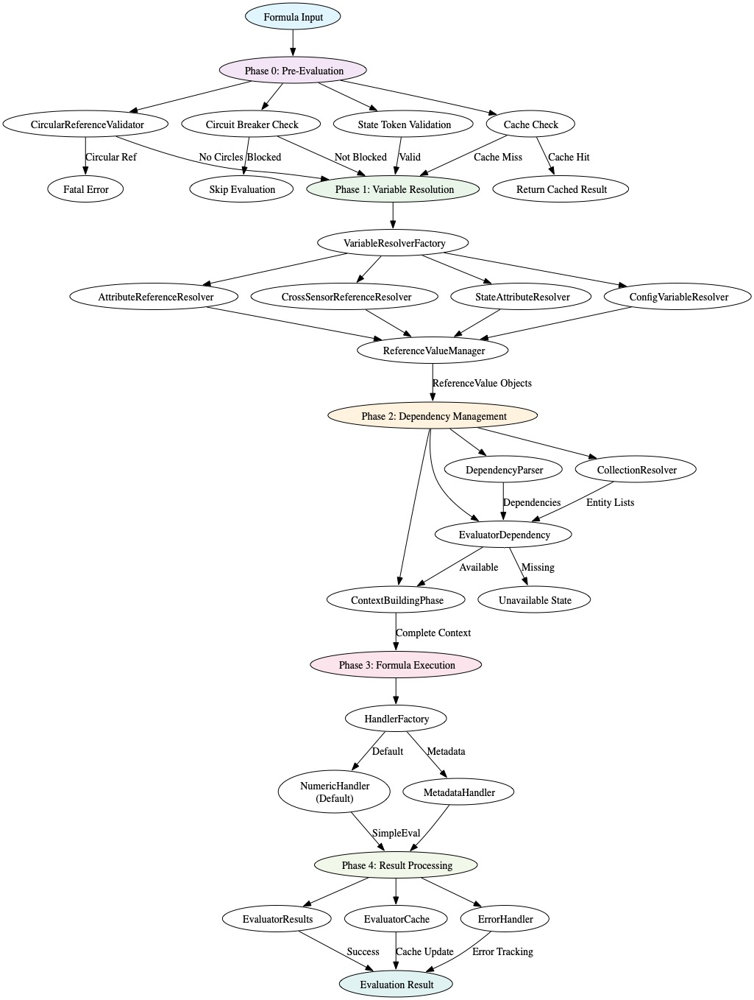

# HA Synthetic Sensors Architecture Overview

## Introduction

The HA Synthetic Sensors system implements a layered architecture for creating and managing synthetic sensors in Home
Assistant. This architecture follows compiler-like design principles with clear separation of concerns, enabling extensible
formula evaluation, robust dependency management, and type-safe entity reference handling.

## Architectural Design

### Layered Design

The system is organized into distinct layers, each with specific responsibilities:

- **Configuration Layer**: Handles YAML parsing, validation, and sensor definition management
- **Evaluation Layer**: Multi-phase formula evaluation with variable resolution and handler routing
- **Storage Layer**: Manages persistence, CRUD operations, and YAML export/import
- **Integration Layer**: Provides Home Assistant integration and entity management

### ReferenceValue Architecture

At the heart of the system is the ReferenceValue architecture that ensures type safety and provides handlers with access to
both entity references and their resolved values. This enables features like the `metadata()` function that require knowledge
of the reference from which the value was derived at any point in the resolution and evaluation pipeline.

#### Lazy Value Resolution

The ReferenceValue system implements lazy value resolution to preserve original entity references throughout the evaluation
pipeline:

- **Reference Preservation**: ReferenceValue objects maintain the original entity reference (e.g., `sensor.power_meter`)
  alongside the resolved value (e.g., `1000.0`)
- **Computed Variable Handling**: Computed variables containing metadata functions use lazy ReferenceValue resolution to
  prevent premature value extraction
- **Evaluation Order Control**: The 4-phase pipeline ensures metadata processing occurs before value resolution, preserving
  references for metadata handlers

### Evaluation Pipeline

Formula evaluation follows a multi-phase approach with distinct responsibilities:

- **Phase 0**: Pre-evaluation validation and preparation
- **Phase 1**: Entity ID resolution and ReferenceValue creation
- **Phase 2**: Metadata function processing and context building
- **Phase 3**: Value resolution and formula execution
- **Phase 4**: Result processing and caching

This phased approach ensures proper evaluation order, particularly for evaluation handlers that require access to original
entity references rather than resolved values. All formula artifacts (main sensor formulas, computed variables, and
attributes) share the same pipeline via a core evaluation service.

## Formula Evaluation Order by Artifact Type

The system evaluates different formula artifacts in a specific order to handle dependencies correctly:

### 1. Configuration Variables

- Evaluated first during variable resolution phase (Phase 1)
- Global settings variables are inherited by all sensors in a sensor set
- Local variable definitions override global ones within their scope
- Creates ReferenceValue objects for use in subsequent evaluations

### 2. Main Sensor Formulas

- Evaluated after variables are resolved
- Can reference configuration variables and backing entities
- Result becomes the primary state value for the synthetic sensor
- Dependency management ensures required entities are available

### 3. Sensor Attributes

- Evaluated after main sensor formula if dependencies exist
- Can reference the main sensor value, other attributes, and configuration variables
- Dependency graph resolution ensures attributes are evaluated in correct order
- Circular attribute references are detected and rejected during pre-evaluation

### 4. Cross-Sensor References

- Handled through SensorRegistryPhase which maintains sensor value registry
- Sensors can reference other synthetic sensors by their key name
- Registry is updated after each successful sensor evaluation
- Enables complex sensor dependency networks

## Evaluation Pipeline Architecture

Each phase has specific responsibilities and cannot proceed until the previous phase completes successfully. All formula keys
whether in the main sensor, attributes, or variables use a single formula evaluation entry point.

### Core Formula Evaluation Service

- Entry points:
  - `FormulaEvaluatorService.evaluate_formula(resolved_formula, original_formula, context)` for main formulas (Phase 3
    execution).
  - `FormulaEvaluatorService.evaluate_formula_via_pipeline(formula, context, *, variables=None, bypass_dependency_management=False)`
    for computed variables and attributes to run the full pipeline (Phases 1–3) with dependency management.
- Computed variables are evaluated by creating a temporary `FormulaConfig` (id `temp_cv_<hash>`) and invoking the same
  evaluator used for main/attribute formulas. A variables view can be supplied to expose global/sensor-level simple variables
  to the computed variable (excluding nested `ComputedVariable` instances to avoid recursion).
- All formula artifacts therefore share identical ordering: variable resolution → pre-eval handlers like metadata → reduction
  from ReferenceValue or numeric from string → evaluation.
- simpleeval evaluation is enhanced with additional functions for datetime, duration, and other capabilities beyond its
  native features

### Variable Scoping and Inheritance

- Scopes:
  - Global variables: available across the sensor set; inherited by all sensors unless locally overridden.
  - Sensor-level variables: available to the main sensor and its attributes.
  - Attribute-level variables: visible only within the attribute formula.
- Inheritance and precedence are handled by `VariableInheritanceHandler`:
  - Precedence: attribute-level > sensor-level > global.
  - Inherited variables are merged into the evaluation context prior to resolution.
- When evaluating computed variables via the unified service, a variables view is constructed from the parent
  `FormulaConfig.variables` (simple values only) to ensure correct scope visibility without forcing premature evaluation of
  nested computed variables.

### Dependency Extraction Coverage

- Dependencies are extracted from:
  - Main formula strings.
  - Sensor-level `variables` including recursive extraction from `ComputedVariable.formula` values.
  - Attribute `formulas` and attribute `variables` (including recursive extraction from `ComputedVariable.formula`).
- This ensures entity references inside computed variables and attributes are tracked, so missing entities trigger
  re-evaluation when they become available (fixes "Undefined variable: 'sensor'" caused by untracked dependencies).

### Lazy ReferenceValue Lifecycle and Substitution

- Phase 1 places `ReferenceValue` objects in the context for entity references and `state`, preserving original references
  and deferring value extraction.
- Phase 2 processes `metadata()` with access to preserved references.
- Phase 3 performs value substitution and evaluation:
  - Variable names in the formula are substituted with values from the handler context, converting numeric strings to
    numbers.
  - Secondary safeguard: any remaining dotted entity_id tokens (e.g., `sensor.x`) are substituted by looking up both an alias
    form (`sensor_x`) and the raw entity_id in the handler context. This covers cases where earlier phases deliberately
    preserved dotted tokens for metadata.
  - Unknown/unavailable states propagate as transient (non-fatal) and will make the synthetic sensor unavailable/unknown
    rather than raising configuration errors.

### Startup and Transient States

- During startup, entities may report `unknown` or `unavailable`. These are treated as transient conditions and do not
  generate errors:
  - Dependency checks classify these states separately from fatal missing entities.
  - Evaluation substitutes values accordingly and propagates transient state to synthetic sensors.
- Logging related to early context building and unresolved tokens is at DEBUG level to keep startup logs clean.

### Logging Guidance

- Context tracing (e.g., `ENTITY_REFERENCE_CONTEXT_DEBUG`) logs at DEBUG.
- Hints about non-substitution in early phases log at DEBUG.
- Core evaluation only logs errors for genuine evaluation failures; dotted token presence is traced at DEBUG before/after
  Phase 3 substitution.

### Phase Coordination and Data Flow

The Evaluator orchestrates phase execution through the `_evaluate_formula_core` method (invoked by
`FormulaEvaluatorService`), which:

1. **Guards Against Premature Execution**: Pre-evaluation checks prevent processing of invalid or cached formulas
2. **Ensures Type Safety**: Variable resolution creates ReferenceValue objects before any handler execution
3. **Manages Dependencies**: Dependency analysis occurs after variable resolution but before execution
4. **Handles Errors Gracefully**: Each phase can return early with appropriate error states
5. **Optimizes Performance**: Caching and circuit breaker patterns prevent unnecessary computation

### Inter-Phase Communication

- **Phase 0 → Phase 1**: Passes validated FormulaConfig and initial context
- **Phase 1 → Phase 2**: Provides resolved formula with ReferenceValue objects
- **Phase 2 → Phase 3**: Delivers complete evaluation context with validated dependencies, preserving entity references in
  `ReferenceValue` objects for value substitution
- **Phase 3 → Phase 4**: Returns raw computation results for standardization
- **Phase 4 → Caller**: Provides standardized EvaluationResult with state information

### Error Propagation Strategy

The system implements a two-tier error handling approach:

- **Fatal Errors**: Configuration issues, circular dependencies, missing entity mappings trigger immediate failure
- **Transient Errors**: Temporary entity unavailability propagates as "unknown" or "unavailable" state, allowing recovery.
  Startup conditions where entities are not yet available are treated as transient, not fatal.
- **Circuit Breaker**: Repeated failures activate skip logic to prevent resource waste
- **State Propagation**: Error states flow through phases to provide meaningful sensor states

### Performance Optimizations

- **Early Exit**: Cache hits and circuit breaker activation prevent unnecessary phase execution
- **Compilation Caching**: Resolved formulas and compiled expressions are cached across evaluations
- **Reference Sharing**: ReferenceValueManager prevents duplicate entity lookups
- **Batch Processing**: Collection patterns are resolved efficiently in single operations

## Evaluation Pipeline Diagram

The following diagram illustrates the complete evaluation pipeline with all phases, components, and data flow:

_Figure: Multi-phase evaluation pipeline showing the flow from formula input through entity ID resolution, metadata
processing, value resolution, formula execution, and result processing. The 4-phase approach with lazy ReferenceValue
resolution ensures metadata functions receive original entity references rather than prematurely resolved values._

## Major Components

### 1. Configuration Management

#### ConfigManager

Central configuration management component responsible for:

- Loading and validating YAML configurations
- Managing sensor sets and global settings
- Coordinating configuration updates and persistence
- Providing configuration validation and error reporting

#### SchemaValidator

Handles comprehensive schema validation for YAML configurations:

- Validates sensor definitions against schema rules
- Ensures type safety and structural integrity
- Provides detailed error messages for configuration issues
- Supports both individual sensor and batch validation

#### ConfigModels

Defines the data models for configuration structures:

- SensorConfig: Represents individual sensor definitions
- AttributeConfig: Handles sensor attribute configurations
- GlobalSettings: Manages global configuration settings
- VariableConfig: Represents variable definitions and references

### 2. Sensor Management

#### SensorManager

Core sensor lifecycle management component:

- Creates and manages DynamicSensor entities
- Handles sensor registration with Home Assistant
- Coordinates sensor updates and state changes
- Manages sensor metadata and device associations

#### SensorSet

Container for managing groups of related sensors:

- Maintains sensor collections with shared configuration
- Handles cross-sensor references and dependencies
- Provides bulk operations for sensor management
- Manages entity indexing and tracking

#### SensorSetGlobalSettings

Manages global settings that apply to all sensors in a set:

- Handles variable inheritance and scoping
- Manages device identifier associations
- Provides default metadata and configuration
- Coordinates global settings updates

### 3. Evaluation System

#### Evaluator

Main evaluation orchestrator that coordinates the multi-phase evaluation process:

- **Phase Coordination**: Manages five distinct evaluation phases in strict order with lazy ReferenceValue resolution
- **Circuit Breaker Pattern**: Implements two-tier error handling (fatal vs transient errors)
- **Dependency Management**: Handles cross-sensor references and attribute dependencies
- **Error Resilience**: Distinguishes between configuration errors and runtime failures
- **Performance Optimization**: Integrates caching and compilation optimizations
- **Metadata Function Support**: Ensures metadata functions receive original entity references, not prematurely resolved
  values

#### VariableResolutionPhase

Phase 1 of the evaluation pipeline responsible for reference resolution:

- **Reference Resolution**: Converts entity references, variables, and cross-sensor references to ReferenceValue objects
- **Entity Detection**: Identifies Home Assistant state patterns and handles direct state access
- **Collection Expansion**: Resolves collection patterns (device_class, area, label) to actual entity lists
- **Variable Inheritance**: Applies global settings and handles variable scoping rules
- **Type Safety**: Ensures all resolved values are wrapped in ReferenceValue objects
- **Lazy Value Resolution**: Preserves original entity references in ReferenceValue objects for metadata function processing

#### ReferenceValueManager

Central component for managing ReferenceValue objects:

- Maintains entity reference registry for consistency
- Prevents double wrapping of ReferenceValue objects
- Provides type-safe context conversion
- Ensures memory efficiency through shared instances
- **Lazy Resolution Support**: Enables delayed value extraction to preserve original references for metadata functions
- **Computed Variable Handling**: Special handling for computed variables containing metadata functions to prevent premature
  value resolution

#### PreEvaluationPhase

Phase 0 component that validates formulas before any processing:

- **Circular Reference Detection**: Uses CircularReferenceValidator to detect dependency loops
- **Circuit Breaker Management**: Checks ErrorHandler to skip repeatedly failing formulas
- **Cache Validation**: Leverages EvaluatorCache to return cached results when available
- **State Token Validation**: Validates proper use of 'state' token in formulas

#### DependencyManagementPhase

Phase 2 component that handles dependency analysis and context preparation:

- **Dependency Extraction**: Uses DependencyParser to identify all entity dependencies
- **Collection Processing**: Expands collection patterns into concrete entity lists
- **Availability Checking**: Validates that all required entities are accessible
- **Context Merging**: Combines resolved variables with dependency data

#### ContextBuildingPhase

Phase 2 component that builds the final evaluation context:

- **Variable Integration**: Merges configuration variables with runtime context
- **Reference Validation**: Ensures all references are properly resolved
- **Context Normalization**: Standardizes context format for handler consumption
- **Priority Resolution**: Handles variable precedence (runtime > config > global)

#### FormulaExecutionEngine

Phase 3 component that executes resolved formulas using specialized handlers:

- **Handler Selection**: Uses HandlerFactory to select appropriate handler based on formula content
- **Expression Evaluation**: Integrates with SimpleEval for mathematical expressions
- **Error Handling**: Provides structured error reporting and state propagation
- **Result Processing**: Converts handler results to standardized EvaluationResult objects

### 4. Handler Architecture (Phase 3 Components)

The handler system executes resolved formulas based on their content type. All handlers operate on ReferenceValue objects
created during Phase 1.

#### HandlerFactory

Selects and instantiates appropriate handlers based on formula analysis:

- **Content Analysis**: Examines formula to determine required handler type
- **Handler Selection**: Routes to NumericHandler or MetadataHandler based on formula content
- **Fallback Logic**: NumericHandler serves as the default handler for most expressions
- **Extension Support**: Enables registration of custom handler types

#### NumericHandler

Processes mathematical expressions and calculations:

- **SimpleEval Integration**: Uses enhanced SimpleEval for safe expression evaluation
- **ReferenceValue Extraction**: Converts ReferenceValue objects to numeric values
- **Collection Functions**: Implements sum(), avg(), min(), max() for entity collections
- **Mathematical Operations**: Supports standard arithmetic and advanced functions
- **Default Handler**: Serves as the fallback handler for most formula types

#### MetadataHandler

Provides access to Home Assistant entity metadata:

- **metadata() Function**: Implements the metadata(entity_id, attribute) function
- **Entity Registry Access**: Retrieves entity information from Home Assistant registry
- **Dynamic Lookups**: Enables runtime metadata queries within formulas
- **Reference Validation**: Ensures entity exists before metadata access
- **ReferenceValue Support**: Processes ReferenceValue objects containing original entity references
- **Lazy Resolution Integration**: Works with the 4-phase pipeline to receive original references, not prematurely resolved
  values

### 5. Variable Resolution System

#### VariableResolverFactory

Factory for creating and managing specialized variable resolvers:

- Coordinates different resolver types
- Provides unified resolution interface
- Handles resolver selection and routing
- Manages resolver lifecycle and state

#### Specialized Resolvers

Domain-specific resolvers for different reference types:

- **StateAttributeResolver**: Handles state.attribute patterns
- **EntityReferenceResolver**: Manages direct entity references
- **CrossSensorReferenceResolver**: Processes cross-sensor dependencies
- **SelfReferenceResolver**: Handles sensor self-references
- **ConfigVariableResolver**: Manages configuration variables
- **EntityAttributeResolver**: Processes entity attribute access

### 6. Storage and Persistence

#### StorageManager

Central storage management component:

- Handles YAML configuration persistence
- Manages sensor set storage operations
- Provides import/export functionality
- Coordinates storage updates and validation

#### StorageSensorOps

Handles sensor-specific storage operations:

- Manages sensor CRUD operations
- Handles sensor configuration updates
- Provides sensor migration capabilities
- Coordinates sensor storage validation

#### StorageYamlHandler

Specialized YAML processing component:

- Handles YAML serialization and deserialization
- Manages YAML formatting and structure
- Provides YAML validation and error reporting
- Supports YAML versioning and migration

### 7. Entity Management

#### EntityRegistryListener

Monitors and responds to Home Assistant entity registry changes:

- Detects entity ID renames and updates
- Coordinates system-wide entity reference updates
- Handles entity registry event processing
- Provides entity change resilience

#### EntityChangeHandler

Coordinates system-wide responses to entity changes:

- Manages cache invalidation across components
- Coordinates configuration updates
- Handles integration callbacks
- Ensures system consistency after entity changes

#### EntityIndex

Maintains comprehensive entity reference tracking:

- Indexes all entity references in sensor configurations
- Supports efficient entity lookup and dependency analysis
- Provides entity relationship mapping
- Handles entity collision detection and resolution

### 8. Cross-Sensor Reference Management

#### CrossSensorReferenceManager

Manages cross-sensor dependencies and references:

- Detects and analyzes cross-sensor dependencies
- Maintains sensor registry for value sharing
- Handles circular reference detection
- Coordinates evaluation order based on dependencies

#### CrossSensorReferenceDetector

Identifies cross-sensor references in configurations:

- Analyzes formulas for sensor key references
- Builds dependency graphs between sensors
- Provides reference resolution strategies
- Handles collision detection and resolution

#### CrossSensorReferenceReassignment

Manages entity ID reassignment for cross-sensor references:

- Updates references when entity IDs change
- Handles collision resolution with suffix generation
- Maintains reference integrity across updates
- Provides reference validation and error handling

### 9. Formula Processing

#### FormulaPreprocessor

Prepares formulas for evaluation:

- Handles formula normalization and formatting
- Manages formula validation and syntax checking
- Provides formula optimization opportunities
- Supports formula transformation and enhancement

#### FormulaCompilationCache

Caches compiled formulas for performance:

- Stores compiled AST formula representations
- Provides cache invalidation and updates
- Handles cache key generation and management
- Supports cache statistics and monitoring

#### FormulaUtils

Utility functions for formula processing:

- Provides formula analysis and inspection
- Handles formula transformation and manipulation
- Supports formula validation and error detection
- Manages formula optimization opportunities

### 10. Collection Processing

#### CollectionResolver

Handles collection-based operations and aggregations:

- Processes collection patterns (device_class, area, label)
- Manages collection functions (sum, avg, count, min, max)
- Supports collection filtering and exclusion
- Provides collection validation and error handling

### 11. Device Management

#### DeviceAssociation

Manages device associations for sensors:

- Handles device creation and registration
- Manages device metadata and properties
- Coordinates device-sensor relationships
- Provides device-based entity organization

#### EntityFactory

Creates and manages Home Assistant entities:

- Handles entity creation and configuration
- Manages entity metadata and properties
- Supports entity registration and updates
- Provides entity lifecycle management

### 12. Integration Layer

#### Integration

Main Home Assistant integration component:

- Handles Home Assistant setup and configuration
- Manages integration lifecycle and state
- Provides service interfaces and APIs
- Coordinates integration updates and maintenance

#### ServiceLayer

Provides service interfaces for external interactions:

- Handles service calls and requests
- Manages service validation and error handling
- Provides service documentation and discovery
- Supports service extensibility and customization

## Component Interactions

### Configuration Flow

1. **ConfigManager** loads YAML configurations
2. **SchemaValidator** validates configuration structure
3. **ConfigModels** create typed configuration objects
4. **SensorManager** creates sensor entities based on configuration
5. **SensorSet** organizes sensors into manageable groups

### Evaluation Flow

The evaluation pipeline processes formulas through distinct phases, each with specific responsibilities:

#### Phase 0: Pre-Evaluation (PreEvaluationPhase)

1. **CircularReferenceValidator** detects circular dependencies before any resolution
2. **ErrorHandler** checks circuit breaker status to skip repeatedly failing formulas
3. **EvaluatorCache** checks for cached results to avoid re-computation
4. **StateTokenValidator** validates state token resolution for formulas using 'state'

#### Phase 1: Entity ID Resolution (VariableResolutionPhase)

1. **VariableResolverFactory** creates specialized resolvers for different reference types
2. **EntityReferenceResolver** resolves entity references to ReferenceValue objects (preserving original references)
3. **CrossSensorReferenceResolver** resolves references to other synthetic sensors
4. **StateAttributeResolver** processes entity.attribute patterns
5. **ConfigVariableResolver** resolves configuration variables
6. **VariableInheritanceHandler** applies global settings and variable inheritance
7. **ReferenceValueManager** creates type-safe ReferenceValue objects with lazy value resolution

**Key Feature**: All entity references are converted to ReferenceValue objects that preserve the original reference while
allowing lazy value extraction during later phases.

#### Phase 2: Entity Reference-Reliant Handler Processing (VariableResolutionPhase)

Certain handlers are reliant on entity references to carry out work before evaluation. The metadata handler is one such
entity that needs an entity_id or 'state' token as its first parameter (by convention) to perform work just before
evaluation. The metadata handler needs an entity_id to query HA about metadata like 'last_changed' state. Normally entity
references would be resolve to values but we avoid this step to allow these handlers to use that entity reference first.

1. **Metadata Function Detection**: Identifies `metadata()` function calls in formulas
2. **MetadataHandler Processing**: Processes metadata functions with access to ReferenceValue objects containing original
   references
3. **Function Replacement**: Replaces metadata function calls with their resolved results
4. **Context Preservation**: Maintains ReferenceValue objects in context for subsequent processing

**Key Feature**: Entity Reference Handlers, e.g., Metadata functions receive ReferenceValue objects with original entity
references (e.g., `sensor.power_meter`), not prematurely resolved values (e.g., `1000.0`), enabling proper metadata lookup.

#### Gated evaluation of entity reference reliant handlers (e.g., metadata) containing computed variables

- Computed variables whose formulas contain `metadata(...)` are discovered during variable resolution.
- To preserve the single-entry evaluation model and avoid spreading handler awareness, they are evaluated (when possible) in
  the same resolver pass that already processes metadata for the current formula.
- Gate conditions:
  - `_hass` and `current_sensor_entity_id` exist in context, and
  - `hass.states.get(current_sensor_entity_id)` returns a state object.
- When the gate passes, the computed variable is evaluated via the unified pipeline and its `ReferenceValue` is updated to
  hold the concrete boolean/numeric result. When the gate fails (e.g., during startup), a lazy `ReferenceValue` with
  `value=None` is kept for that cycle. On later polls, once the entity is present, the resolver evaluates and updates the
  computed variable, so attribute formulas that reference it (e.g., `grace_period_active: within_grace`) substitute a real
  boolean instead of `None`.

#### Phase 3: Value Resolution (CoreFormulaEvaluator)

1. **ReferenceValue Extraction**: Extracts actual values from ReferenceValue objects for final formula evaluation
2. **Formula Substitution**: Replaces variable references with resolved values in the formula string
3. **SimpleEval Execution**: Performs final mathematical evaluation using SimpleEval
4. **Result Processing**: Converts evaluation results to standardized format

**Key Feature**: Value extraction occurs only at the final evaluation stage, ensuring metadata functions have access to
original references throughout the pipeline.

#### Phase 4: Formula Execution (FormulaExecutionEngine)

1. **HandlerFactory** selects appropriate handler based on formula content
2. **NumericHandler** processes mathematical expressions using SimpleEval (default handler)
3. **MetadataHandler** provides entity metadata access via metadata() function (processed in Phase 2)

#### Phase 5: Result Processing

1. **EvaluatorResults** creates standardized result objects
2. **EvaluatorCache** caches successful results for performance
3. **ErrorHandler** tracks evaluation success/failure for circuit breaker logic

### Storage Flow

1. **StorageManager** coordinates persistence operations
2. **StorageYamlHandler** handles YAML serialization
3. **StorageSensorOps** manages sensor-specific storage
4. **EntityIndex** updates entity reference tracking

### Entity Change Flow

1. **EntityRegistryListener** detects entity changes
2. **EntityChangeHandler** coordinates system updates
3. **StorageManager** updates persisted configurations
4. **CrossSensorReferenceManager** updates references
5. **FormulaCompilationCache** invalidates affected formulas

## Architectural Considerations

### Extensibility

The handler architecture, pluggable comparison, and modular design enable extension of functionality through new handlers,
resolvers, and evaluation phases.

### Performance

Multi-layered caching, compiled formulas, and efficient reference resolution provide high performance for complex sensor
configurations.

### Resilience

The system gracefully handles entity changes, configuration updates, and error conditions without requiring manual
intervention.

### Maintainability

Clear separation of concerns, well-defined interfaces, and extensive testing.
