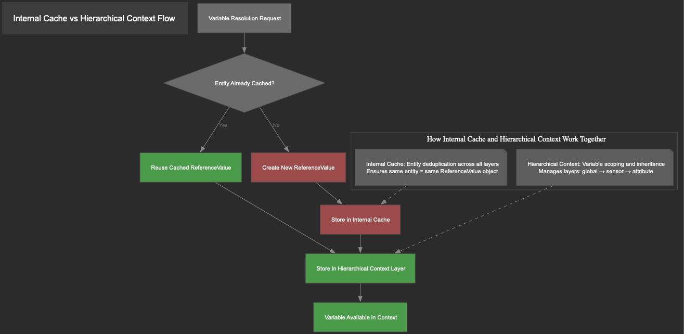
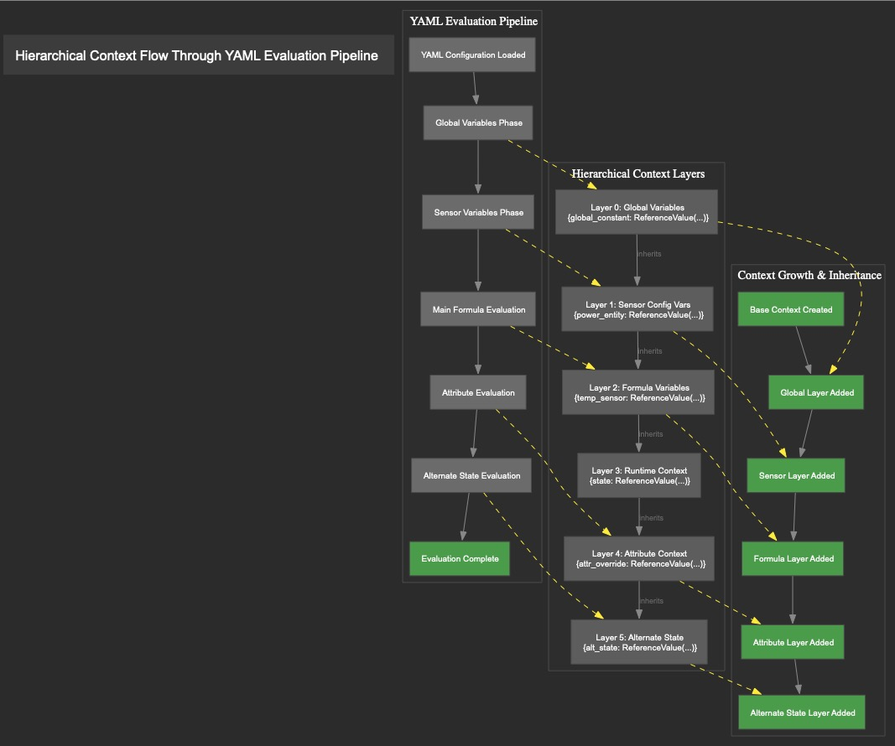

# Context and Reference Value Implementation Guide

> Status: Updated to reflect AST binding plans and lazy context population. The previous "build a complete AST-driven context
> once, for all formulas" concept is deprecated. The system keeps the existing 0–4 phase pipeline and uses per-formula binding
> plans to achieve performance without over-allocating context.

## Overview

The synthetic sensors system uses a **unified AST-driven architecture** that aligns parse-once analysis with per-formula binding
plans and lazy context population:

```text
┌─────────────────┐    ┌─────────────────────┐    ┌─────────────────┐
│   AST Service   │───▶│  Binding Plan (per  │───▶│   Evaluation    │
│   Parse Once    │    │  formula, cached)   │    │  Lazy Context   │
└─────────────────┘    └─────────────────────┘    └─────────────────┘
        │                       │                       │
   Analyzes ALL            Names, kinds,            Creates only the
   formulas (cached)       strategies               variables needed,
                                                   resolves on access
```

This unified architecture ensures that:

1. **AST Parse-Once Foundation**: `FormulaASTAnalysisService` analyzes formulas and caches results
2. **Binding Plans**: A lightweight plan per formula provides referenced names, function kinds, and resolution strategies
3. **Lazy Context Population**: Phases create only the variables required by the current formula and resolve values on first use
4. **Architectural Alignment**: Parse-once → Plan-once → Evaluate lazily

This eliminates wasted work from pre-allocating unused variables while maintaining context integrity and inheritance across
phases.

## Implementation Plan and Next Steps

The goal is full "parse once" across all evaluation paths while preserving the 0–4 phase pipeline. We will implement the
following steps in order. Tests are added first and expanded at each step.

### Code Quality Requirements

All implementation must adhere to strict quality standards:

- **Type Safety**: Use strict typing with no `Any` types - use `TypedDict` or proper type hints
- **Imports**: ALL imports at the top of files (except test files where method-level imports are acceptable)
- **Zero Linting Errors**: Code must pass `mypy --strict`, `pylint`, and `ruff` with zero errors
- **Formatting**: Use the precommit formatting scripts for formattting avoiding model driven formatting
- **Testing**: Tests do not require mypy/pylint compliance but must have meaningful assertions
- **No Fallback Code**: Ensure deterministic behavior - no fallback patterns allowed

1. AST service: add BindingPlan
   - Define `BindingPlan` (names, function kinds, collection flags, resolution strategies)
   - Expose `build_binding_plan(formula: str) -> BindingPlan` in `FormulaASTAnalysisService`

2. Collections in AST service
   - Migrate collection parsing from the legacy shim into the AST service
   - Normalize query keys (device_class/area/label/predicate) to support targeted caching/invalidation

3. Minimal context preparation and lazy resolution
   - Implement `_prepare_minimal_layer(context, plan)` to add only required names
   - Add a lazy resolver that resolves values on first access and memoizes for the current cycle

4. Phase consumption of plans
   - Update `VariableResolutionPhase` (and dependent phases) to consume `BindingPlan` instead of broad extraction
   - Preserve Option C dynamic discovery (listeners update at runtime)

5. Metadata handler write path
   - Ensure `_metadata_*` keys are set via the unified setter and wrapped as `ReferenceValue`

6. Phase 4 correctness for booleans
   - Audit result consolidation to use `is None` checks (preserve `False` values)
   - Add a regression test for the `False` preservation path

7. Per-cycle batching
   - Batch HA state lookups per cycle and cache a states view for the duration of the cycle

8. Tests and metrics
   - New tests: plan construction, minimal layer prep, lazy resolution memoization, metadata injection, `False` preservation
   - Integrations: run full suite after new tests pass; add lightweight metrics (compilation cache hit rate, context/object
     churn)

9. Retire legacy shim
   - Remove `DependencyParser` shim and update docs

## Execution Order (Tests First)

### Milestone 0: Performance Baseline

- Measure current evaluation times for SPAN sensors
- Count ReferenceValue object creations per cycle
- Record compilation cache hit rates
- Document current memory usage patterns

### Milestone A: Test Suite Creation

- Add binding plan construction tests
- Add minimal layer preparation tests
- Add lazy resolution memoization tests
- Add boolean False preservation tests
- Add metadata injection tests
- Ensure all new tests fail before implementation

### Milestone B: Core Implementation

- Implement BindingPlan dataclass and builder
- Implement \_prepare_minimal_layer() function
- Create LazyResolver with memoization
- Ensure code passes mypy --strict, pylint, ruff

### Milestone C: Phase Integration

- Update VariableResolutionPhase to use binding plans
- Fix metadata handler to use unified setter
- Audit Phase 4 for is None checks (False preservation)
- Run formatters (black, isort) on all modified files

### Milestone D: Collections and Optimization

- Migrate collection parsing to AST service
- Implement HA state batching
- Add performance metrics collection
- Verify no regression in benchmarks

### Milestone E: Cleanup and Validation

- Remove DependencyParser legacy shim
- Run full integration test suite
- Compare performance against baseline
- Update documentation

## Critical Implementation Details

### Phase 4 Boolean Preservation Fix

```python
def process_phase_4_result(result: Any, alternate_state_type: str = None) -> EvaluationResult:
    """Process Phase 4 result with explicit False preservation."""
    # CRITICAL: Use 'is None' not truthiness checks
    if result is None:
        return EvaluationResult(success=False, value=None, error="Result is None")

    # Preserve False explicitly
    if result is False:
        return EvaluationResult(success=True, value=False)

    # Handle other falsy values that should be preserved
    if result == 0 or result == 0.0:
        return EvaluationResult(success=True, value=result)

    if result == "":  # Empty string
        return EvaluationResult(success=True, value=result)

    # Normal processing for truthy values
    return EvaluationResult(success=True, value=result)
```

### Metadata Handler Unified Setter Fix

```python
class MetadataHandler:
    """Handler for metadata() function calls."""

    def evaluate(self, formula: str, context: EvaluationContext) -> tuple[str, dict[str, Any]]:
        """Transform metadata calls for AST caching and inject results."""
        # Parse metadata calls from formula
        metadata_calls = self._extract_metadata_calls(formula)
        transformed_formula = formula
        metadata_results = {}

        for idx, (entity_ref, metadata_key) in enumerate(metadata_calls):
            # Get entity reference from context
            ref_value = context.get(entity_ref)
            if isinstance(ref_value, ReferenceValue):
                entity_id = ref_value.reference
            else:
                entity_id = entity_ref

            # Retrieve metadata value
            metadata_value = self._get_metadata(entity_id, metadata_key)

            # Transform formula for AST caching
            key = f"_metadata_{idx}"
            old_call = f"metadata({entity_ref}, '{metadata_key}')"
            new_call = f"metadata_result({key})"
            transformed_formula = transformed_formula.replace(old_call, new_call)

            # CRITICAL: Use unified setter for context injection
            # This ensures _metadata_* keys are wrapped as ReferenceValue
            metadata_ref = ReferenceValue(reference=key, value=metadata_value)

            # Get underlying hierarchical context to use unified setter
            if hasattr(context, 'get_hierarchical_context'):
                context.get_hierarchical_context().set(key, metadata_ref)
            else:
                # Fallback for testing
                context[key] = metadata_ref

            metadata_results[key] = metadata_value

        return (transformed_formula, metadata_results)
```

### Collection Query Normalization

```python
def _extract_collection_queries(analysis: FormulaAnalysis) -> list[str]:
    """Extract and normalize collection queries for caching."""
    queries = []
    for func_info in getattr(analysis, 'collection_functions', []):
        # Normalize query for consistent caching
        query_parts = []

        if func_info.get('device_class'):
            query_parts.append(f"device_class:{func_info['device_class']}")
        if func_info.get('area'):
            query_parts.append(f"area:{func_info['area']}")
        if func_info.get('label'):
            query_parts.append(f"label:{func_info['label']}")
        if func_info.get('predicate'):
            # Normalize predicate (e.g., "state:on" -> "state==on")
            predicate = func_info['predicate']
            normalized = _normalize_predicate(predicate)
            query_parts.append(f"predicate:{normalized}")

        if query_parts:
            queries.append("|".join(sorted(query_parts)))

    return queries

def _normalize_predicate(predicate: str) -> str:
    """Normalize predicate for consistent caching."""
    # Convert various formats to canonical form
    # "state:on" -> "state==on"
    # "attribute:value>=50" -> "attribute>=50"
    if ":" in predicate and not any(op in predicate for op in [">=", "<=", "==", "!=", ">", "<"]):
        parts = predicate.split(":", 1)
        return f"{parts[0]}=={parts[1]}"
    return predicate
```

## Success Criteria

- New plan/lazy-context tests pass first
- Full integration test suite passes with no behavior regressions
- Boolean False values preserved through entire pipeline
- Metadata handler uses unified setter for _metadata_\* keys
- Collection queries normalized for consistent caching
- Dependency on `DependencyParser` shim removed
- Equal or improved evaluation timings in benchmarks
- Reduced object churn across cycles (measured via Milestone 0 baseline)

## Unified AST-Driven Architecture Components

The system consists of three tightly integrated components that work together to provide complete AST-driven evaluation:

### Component 1: AST Parse-Once Analysis

```python
class FormulaASTAnalysisService:
    """Parse-once foundation that analyzes ALL sensor formulas and caches results."""

    def analyze_complete_sensor(self, sensor_config: SensorConfig) -> CompleteSensorAnalysis:
        """Analyze ALL formulas for a sensor in one operation."""
        all_formulas = self._extract_all_sensor_formulas(sensor_config)
        complete_analysis = {}

        for formula_name, formula_str in all_formulas.items():
            # Parse once, cache forever
            analysis = self.get_formula_analysis(formula_str)  # Cached!
            complete_analysis[formula_name] = analysis

        return CompleteSensorAnalysis(
            formulas=all_formulas,
            analysis=complete_analysis,
            all_dependencies=self._aggregate_dependencies(complete_analysis),
            all_literals=self._extract_all_literals(complete_analysis)
        )
```

### Component 2: Binding Plan Construction

```python
from __future__ import annotations

from dataclasses import dataclass, field
from typing import Literal, frozenset

@dataclass(frozen=True)
class BindingPlan:
    """Immutable per-formula plan describing names and how to resolve them."""
    names: frozenset[str]
    has_metadata: bool
    has_collections: bool
    strategies: dict[str, Literal["ha_state", "data_provider", "literal", "computed", "cross_sensor"]]
    collection_queries: list[str] = field(default_factory=list)
    metadata_calls: list[tuple[str, str]] = field(default_factory=list)

def build_binding_plan(ast_service: FormulaASTAnalysisService, formula: str) -> BindingPlan:
    """Build a binding plan from AST analysis with caching."""
    # Check plan cache first
    cache_key = f"plan_{hash(formula)}"
    if cache_key in ast_service._plan_cache:
        return ast_service._plan_cache[cache_key]

    analysis = ast_service.get_formula_analysis(formula)
    plan = BindingPlan(
        names=frozenset(analysis.variables | analysis.entity_references),
        has_metadata=analysis.has_metadata,
        has_collections=len(getattr(analysis, "collection_functions", [])) > 0,
        strategies=_infer_strategies(analysis),
        collection_queries=_extract_collection_queries(analysis),
        metadata_calls=_extract_metadata_calls(analysis)
    )

    # Cache the plan
    ast_service._plan_cache[cache_key] = plan
    return plan

def _infer_strategies(analysis: FormulaAnalysis) -> dict[str, Literal[...]]:
    """Infer resolution strategy for each name in the formula."""
    strategies = {}
    for name in analysis.variables | analysis.entity_references:
        if name == "state" or name.startswith("sensor.") or name.startswith("binary_sensor."):
            strategies[name] = "ha_state"
        elif name in analysis.cross_sensor_refs:
            strategies[name] = "cross_sensor"
        elif name in analysis.literal_values:
            strategies[name] = "literal"
        elif name in analysis.computed_variables:
            strategies[name] = "computed"
        else:
            strategies[name] = "data_provider"
    return strategies
```

### Component 3: Lazy Context Evaluation

```python
from typing import Any, Optional
from collections import defaultdict

class LazyResolver:
    """Resolves values lazily on first access with cycle-scoped memoization."""

    def __init__(self, hass: HomeAssistant, data_provider: DataProviderCallback):
        self._hass = hass
        self._data_provider = data_provider
        self._cycle_cache: dict[str, Any] = {}
        self._cycle_id = 0

    def start_new_cycle(self) -> None:
        """Start a new evaluation cycle, clearing memoization cache."""
        self._cycle_id += 1
        self._cycle_cache.clear()

    def resolve_if_needed(self, ctx: HierarchicalContextDict, name: str) -> Any:
        """Resolve value on first access, memoize for remainder of cycle."""
        # Check if already resolved this cycle
        cache_key = f"{self._cycle_id}:{name}"
        if cache_key in self._cycle_cache:
            return self._cycle_cache[cache_key]

        # Get ReferenceValue from context
        ref_value = ctx.get(name)
        if not isinstance(ref_value, ReferenceValue):
            return ref_value  # Already resolved or not a reference

        # Resolve based on strategy
        if ref_value.value is None:  # Lazy - needs resolution
            strategy = ctx.get(f"_strategy_{name}", "ha_state")
            resolved = self._resolve_by_strategy(name, strategy)
            # Update ReferenceValue in place
            ref_value._value = resolved
            self._cycle_cache[cache_key] = resolved

        return ref_value.value

    def _resolve_by_strategy(self, name: str, strategy: str) -> Any:
        """Resolve value based on strategy."""
        if strategy == "ha_state":
            state = self._hass.states.get(name)
            return state.state if state else None
        elif strategy == "data_provider":
            result = self._data_provider(name)
            return result.value if result else None
        elif strategy == "literal":
            # Literals should already have values
            return None
        elif strategy == "computed":
            # Computed variables resolved elsewhere
            return None
        elif strategy == "cross_sensor":
            # Cross-sensor resolved via registry
            return None
        return None

def _prepare_minimal_layer(ctx: HierarchicalContextDict, plan: BindingPlan,
                           lazy_resolver: Optional[LazyResolver] = None) -> None:
    """Prepare minimal context layer with only required names from plan."""
    # Add new layer for this formula's requirements
    ctx.push_layer(f"formula_{hash(plan)}")

    # Create ReferenceValue shells for each name in plan
    for name in plan.names:
        if name not in ctx:  # Don't override existing
            strategy = plan.strategies.get(name, "ha_state")
            # Store strategy for lazy resolver
            ctx.set(f"_strategy_{name}", strategy)

            # Create lazy ReferenceValue (value=None)
            if strategy == "literal":
                # Literals get immediate values
                # This would come from AST analysis
                value = _get_literal_value(name)
                ref_value = ReferenceValue(reference=name, value=value)
            else:
                # Everything else is lazy
                ref_value = ReferenceValue(reference=name, value=None)

            ctx.set(name, ref_value)

    # Store plan metadata for phases
    ctx.set("_binding_plan", plan)

    # If lazy resolver provided, prepare for memoization
    if lazy_resolver:
        lazy_resolver.start_new_cycle()

class LazyContextEvaluator:
    """Evaluates formulas using binding plans and lazy variable resolution within the existing phases."""

    def __init__(self, ast_service: FormulaASTAnalysisService, core_evaluator: CoreFormulaEvaluator):
        self.ast_service = ast_service
        self._core_evaluator = core_evaluator
        self._lazy_resolver = None  # Injected per evaluation

    def evaluate_formula(self, formula: str, ctx: HierarchicalContextDict,
                        lazy_resolver: LazyResolver) -> EvaluationResult:
        """Evaluate formula with binding plan and lazy resolution."""
        plan = build_binding_plan(self.ast_service, formula)

        # Populate only required names; values are resolved on access by handlers
        _prepare_minimal_layer(ctx, plan, lazy_resolver)

        # Inject lazy resolver for handlers to use
        ctx.set("_lazy_resolver", lazy_resolver)

        return self._core_evaluator.evaluate_formula(formula, ctx)
```

### AST Analysis Drives Minimal Context Preparation

The AST service analyzes ALL sensor formulas to identify everything that needs to be in the evaluation context:

1. **Entity References**: AST identifies `sensor.power` → Creates `ReferenceValue("sensor.power", None)` (lazy)
2. **Variables**: AST identifies `temp_offset` → Creates `ReferenceValue("config.temp_offset", None)` (lazy)
3. **Literals**: AST identifies `5.0`, `'unknown'` → Creates `ReferenceValue("literal.5_0", 5.0)` (immediate)
4. **Functions**: AST identifies `metadata()` calls → Preserves references for handler processing
5. **Cross-References**: AST identifies variable dependencies → Ensures complete dependency graph

**Key Point**: Each formula’s binding plan describes exactly what that formula needs. Phases prepare only those names and keep
resolution lazy, preserving Option C dynamic discovery and reducing per-cycle work.

### Plan-Driven Lazy Evaluation Flow

```text
┌─────────────────────────────────────────────────────────────────────────────────────┐
│                           PLAN-DRIVEN LAZY EVALUATION                               │
└─────────────────────────────────────────────────────────────────────────────────────┘

Sensor Configuration
         ↓
Use formula to construct binding plan (main / attribute / alt-state)
         ↓
┌─────────────────┐    ┌─────────────────┐    ┌─────────────────┐
│   AST Service   │───▶│  AST Context    │───▶│ AST Evaluation  │
│   Parse Once    │    │   Plan Once     │    │   Resolve Lazily│
│                 │    │                 │    │                 │
│ • Cached        │    │ • Names/Strategy│    │ • Minimal layer │
│ • Dependencies  │    │ • No over-alloc │    │ • Memoize access│
│ • Literals      │    │ • Testable      │    │ • Same Context  │
└─────────────────┘    └─────────────────┘    └─────────────────┘
         ↓                       ↓                       ↓
    Parse Once              Context Once            Evaluate Many
    (Cached Forever)        (Pre-Built Complete)    (Perfect Inheritance)

Benefits:
✅ Architectural Consistency   ✅ No Missing Variables     ✅ Perfect Context Inheritance
✅ Parse-Once Performance     ✅ Testable Contracts       ✅ Deterministic Evaluation
✅ Complete Context Guarantee ✅ Lazy Value Resolution    ✅ Zero Context Violations
```

## ReferenceValue Class

```python
class ReferenceValue:
    """Universal container for entity references and their resolved values."""

    def __init__(self, reference: str, value: StateType):
        """Initialize a reference/value pair.

        Args:
            reference: Original reference (variable name, entity ID, etc.)
            value: Resolved value (e.g., "25.5", 42, True)
        """
        self._reference = reference
        self._value = value

    @property
    def reference(self) -> str:
        """Get the original reference."""
        return self._reference

    @property
    def value(self) -> StateType:
        """Get the resolved value."""
        return self._value
```

**Key Properties:**

- **Entity-centric**: One `ReferenceValue` object per unique `entity_id` stored in `_entity_reference_registry`
- **Shared instances**: All variables referencing the same entity share the same `ReferenceValue` object
- **Collision-aware**: The `reference` includes collision suffixes (e.g., `sensor.power_meter_2`)
- **Type-safe**: Prevents raw values from being passed to handlers expecting entity references

## Entity Registry Architecture

The system maintains an **internal cache** for entity deduplication that works alongside the hierarchical context architecture.
This approach ensures entity consistency while keeping the user-visible context clean.

### Internal Cache Structure

The `ReferenceValueManager` maintains a static internal cache that spans all layers of the hierarchical context:

```python
class ReferenceValueManager:
    # Internal cache for entity deduplication across all layers
    _entity_cache: dict[str, ReferenceValue] = {}

    @classmethod
    def set_variable_with_reference_value(cls, context, var_name, entity_reference, resolved_value):
        if entity_reference in cls._entity_cache:
            # Reuse existing ReferenceValue for this entity
            existing_ref_value = cls._entity_cache[entity_reference]
            context.set(var_name, existing_ref_value)
        else:
            # Create new ReferenceValue for this entity
            ref_value = ReferenceValue(reference=entity_reference, value=resolved_value)
            cls._entity_cache[entity_reference] = ref_value
            context.set(var_name, ref_value)
```

### How Internal Cache and Hierarchical Context Work Together

The **internal cache** and **hierarchical context** serve **different but complementary purposes**:

#### 1. **Hierarchical Context** = **Data Organization & Inheritance**

The hierarchical context manages **layers of context** that inherit from each other:

```python
# Hierarchical Context Structure
HierarchicalEvaluationContext("sensor_evaluation")
├── Layer 0: Global variables    {"global_constant": ReferenceValue(...)}
├── Layer 1: Sensor config vars  {"power_entity": ReferenceValue(...)}
├── Layer 2: Formula variables   {"temp_sensor": ReferenceValue(...)}
└── Layer 3: Runtime context     {"state": ReferenceValue(...)}
```

**Purpose**: Manage **variable scoping, inheritance, and context building** throughout the evaluation pipeline.

#### 2. **Internal Cache** = **Entity Deduplication Across All Layers**

The internal cache ensures **the same entity gets the same ReferenceValue object** regardless of which layer it appears in:

```python
# Internal Cache (spans all layers)
ReferenceValueManager._entity_cache = {
    "sensor.power_meter": ReferenceValue(ref="sensor.power_meter", val=1200.0),
    "sensor.temperature": ReferenceValue(ref="sensor.temperature", val=22.5)
}
```

**Purpose**: Ensure **entity deduplication and object sharing** across the entire evaluation context.

### Architecture Flow



This diagram shows how the internal cache and hierarchical context work together during variable resolution. The internal cache
ensures entity deduplication across all layers, while the hierarchical context manages variable scoping and inheritance.

### Cross-Layer Entity Sharing Example

```python
# Create hierarchical context with multiple layers
base_context = HierarchicalEvaluationContext("evaluation")
base_context.set("global_power", ReferenceValue(ref="sensor.power_meter", val=1200.0))

# Add a new layer
formula_context = base_context.create_child_layer("formula_vars")

# When resolving a variable in the new layer:
ReferenceValueManager.set_variable_with_reference_value(
    context=HierarchicalContextDict(formula_context),
    var_name="local_power",
    var_value="sensor.power_meter",  # Same entity as global_power!
    resolved_value=1200.0
)

# Result: Both layers reference the same ReferenceValue object
global_ref = base_context.get("global_power")
local_ref = formula_context.get("local_power")
assert global_ref is local_ref  # Same object across layers!
```

### Key Benefits

1. **Memory Efficiency**: Single `ReferenceValue` instance per unique entity across all layers
2. **Consistency**: All variables referencing the same entity use identical objects regardless of layer
3. **Clean User Context**: No internal bookkeeping keys visible to users
4. **Cross-Layer Sharing**: Same entity shared efficiently across global, sensor, and attribute layers
5. **Performance**: O(1) lookup for entity reuse
6. **Type Safety**: Centralized management prevents raw value injection

### Why Both Systems Are Needed

**Without Hierarchical Context**: No variable scoping, inheritance, or layered evaluation **Without Internal Cache**: Duplicate
ReferenceValue objects for the same entity across layers

```python
# BAD: Without internal cache
layer1["power"] = ReferenceValue(ref="sensor.power", val=1200.0)  # Object A
layer2["power"] = ReferenceValue(ref="sensor.power", val=1200.0)  # Object B (duplicate!)

# GOOD: With internal cache
layer1["power"] = cached_ref  # Object A
layer2["power"] = cached_ref  # Same Object A (shared!)
```

### Summary

The **internal cache** is a **cross-cutting concern** that ensures entity deduplication **across all layers** of the
hierarchical context. They work together to provide:

- **Hierarchical Context**: Proper variable scoping and inheritance
- **Internal Cache**: Efficient entity deduplication and object sharing

The cache operates **orthogonally** to the hierarchical structure - it doesn't care about layers, it just ensures the same
entity always gets the same `ReferenceValue` object, regardless of which layer it appears in!

### How Internal Cache Works with Hierarchical Flow

The internal cache operates **across all layers** of the hierarchical context, ensuring entity deduplication throughout the
entire YAML evaluation pipeline:

```python
# Example: Same entity referenced across multiple layers
# Layer 1: Global variables
global_context.set("power_limit", ReferenceValue("config.power_limit", 5000.0))

# Layer 2: Sensor variables
sensor_context.set("power_entity", ReferenceValue("sensor.power_meter", 1200.0))

# Layer 4: Attribute evaluation
attribute_context.set("is_critical", ReferenceValue("attr.is_critical", False))

# All three layers can reference the same entity (e.g., sensor.power_meter)
# The internal cache ensures they share the same ReferenceValue object
```

**Key Benefits of This Architecture**:

- **Cross-Layer Consistency**: Same entity gets same object regardless of which layer it's referenced in
- **Memory Efficiency**: No duplicate ReferenceValue objects for the same entity
- **Clean User Context**: Users only see their variables, not internal deduplication logic
- **Performance**: O(1) lookup for entity reuse across all evaluation phases

## Unified AST-Driven Architecture Implementation

The system implements a **unified AST-driven architecture** where parse-once analysis, context pre-building, and evaluation work
together as an integrated system. This replaces the legacy on-the-fly variable resolution approach.

### AST-Driven Pipeline Workflow

1. **AST Parse-Once Analysis**: `FormulaASTAnalysisService` analyzes ALL sensor formulas and caches results
2. **AST Context Pre-Building**: `ASTDrivenContextBuilder` uses cached analysis to build complete contexts
3. **AST Evaluation**: `ASTDrivenEvaluator` uses pre-built contexts for all evaluation phases
4. **Perfect Alignment**: Each component uses the output of the previous component

### Architectural Consistency Benefits

- **Parse-Once → Context-Once → Evaluate-Many**: Perfect architectural alignment
- **Complete Context Guarantee**: All variables exist before any evaluation begins
- **Perfect Context Inheritance**: Every evaluation phase receives identical complete context
- **Zero Missing Variables**: Alternate state handlers never encounter `None` variables
- **Testable Architecture**: Both AST analysis and context structure can be validated
- **Performance Optimization**: AST analysis cached, context pre-built, evaluation efficient

**SPAN Integration Example - Unified AST Architecture**:

```python
# Complete AST-driven evaluation solving the last_valid_state = None problem

class UnifiedASTEvaluationPipeline:
    def evaluate_span_sensor(self, sensor_config: SensorConfig) -> SensorResult:
        # Step 1: AST Parse-Once Analysis (Component 1)
        sensor_analysis = self.ast_service.analyze_complete_sensor(sensor_config)
        # Analyzes ALL formulas:
        # - main: "state"
        # - variable_last_valid_state: "metadata(state, 'last_valid_state')"
        # - main_alt_FALLBACK: "last_valid_state if is_within_grace_period else 'unknown'"
        # - variable_is_within_grace_period: "last_valid_state is not None and ..."

        # Step 2: AST Context Pre-Building (Component 2)
        complete_context = self.context_builder.build_complete_context(sensor_analysis)
        # Creates complete context with ALL variables:
        # ✅ last_valid_state: ReferenceValue("metadata(state, 'last_valid_state')", None)
        # ✅ is_within_grace_period: ReferenceValue("formula_result", None)
        # ✅ state: ReferenceValue("state", None)
        # ✅ literal_unknown: ReferenceValue("literal.unknown", "unknown")

        # Step 3: AST Evaluation (Component 3) - All phases use same context
        main_result = self.evaluator.evaluate_with_ast_context("state", complete_context)

        # When alternate state handler runs:
        alt_result = self.evaluator.evaluate_with_ast_context(
            "last_valid_state if is_within_grace_period else 'unknown'",
            complete_context  # Same context! All variables guaranteed to exist!
        )
        # ✅ SUCCESS: No more "last_valid_state = None" errors!

        return SensorResult(main_result, alt_result)

# The unified architecture ensures:
# Parse-Once (AST) → Context-Once (Complete) → Evaluate-Many (Perfect Inheritance)
```

### Resolver Hierarchy

```text
VariableResolverFactory
├── StateAttributeResolver      # Handles state.attribute patterns
├── StateResolver              # Resolves HA entity states
├── SelfReferenceResolver      # Handles entity ID self-references
├── EntityAttributeResolver    # Handles variable.attribute patterns
├── EntityReferenceResolver    # Resolves HA entity references
├── AttributeReferenceResolver # Handles attribute-to-attribute references
├── CrossSensorReferenceResolver # Manages cross-sensor dependencies
└── ConfigVariableResolver     # Fallback for direct values and entity references
```

### Direct Factory Usage

The system uses VariableResolverFactory:

```python
# Modern resolver factory usage in ContextBuildingPhase
def _create_resolver_factory(self, context: dict[str, ContextValue] | None) -> VariableResolverFactory:
    """Create modern variable resolver factory for direct resolution."""
    return VariableResolverFactory(
        hass=self._hass,
        data_provider_callback=self._data_provider_callback,
        sensor_to_backing_mapping=self._sensor_to_backing_mapping,
    )

# Direct resolution without tuple unpacking
resolved_value = resolver_factory.resolve_variable(
    variable_name=entity_id,
    variable_value=entity_id,
    context=eval_context
)
```

### Resolution Benefits

1. **Single Code Path**: Direct factory usage eliminates adapter complexity
2. **Type Safety**: Resolvers return raw values for formula substitution, then values are wrapped in ReferenceValue objects
3. **Performance**: No tuple packing/unpacking overhead
4. **Modular Design**: Each resolver handles specific resolution patterns
5. **Extensible**: Easy to add new resolution strategies
6. **Simple Error Handling**: Direct exception propagation without translation

## Entity ID Collision Handling

When multiple sensors reference the same entity ID, the system automatically adds suffixes:

```python
# Original entity: sensor.power_meter
# After collision detection: sensor.power_meter_2
ReferenceValue(reference="sensor.power_meter_2", value=1000.0)
```

### Collision Resolution Process

1. **Detection**: System identifies entity ID conflicts during sensor registration
2. **Suffix Assignment**: Automatic `_2`, `_3`, etc. suffix generation on entity_id collision in registry
3. **Configuration Update**: All references updated with collision-resolved IDs
4. **Runtime Consistency**: `ReferenceValue` objects use final entity IDs

## ReferenceValue Lifecycle

### 1. **Sensor Creation Phase (Initialization)**

**ReferenceValue objects are NOT created during sensor creation.** The sensor creation process focuses on:

- Creating `DynamicSensor` entities
- Setting up device associations
- Configuring entity attributes
- Registering with Home Assistant

No ReferenceValue objects exist at this stage - they are created dynamically during evaluation.

### 2. **Evaluation Context Creation (Runtime)**

ReferenceValue objects are created during the **Context Building Phase** (`context_building_phase.py`):

```python
# In ContextBuildingPhase._add_entity_to_context()
if isinstance(value, ReferenceValue):
    eval_context[entity_id] = value  # Reuse existing ReferenceValue
else:
    # Create new ReferenceValue for entity
    ReferenceValueManager.set_variable_with_reference_value(
        eval_context, entity_id, entity_id, value
    )
```

### 3. **Variable Resolution Process**

ReferenceValue objects are created in **two main locations**:

#### A. **Data Provider Resolution** (`utils_resolvers.py`)

```python
# In resolve_via_data_provider_entity()
return ReferenceValue(reference=entity_id, value=value)
```

#### B. **Home Assistant State Resolution** (`utils_resolvers.py`)

```python
# In resolve_via_hass_entity()
result = ReferenceValue(reference=entity_id, value=converted_value)
return result
```

### 4. **Entity Registry Management**

The **ReferenceValueManager** (`reference_value_manager.py`) manages the centralized registry:

```python
# Entity-centric registry: one ReferenceValue per unique entity_id
entity_registry = eval_context["_entity_reference_registry"]

if entity_reference in entity_registry:
    # Reuse existing ReferenceValue for this entity
    existing_ref_value = entity_registry[entity_reference]
    eval_context[var_name] = existing_ref_value
else:
    # Create new ReferenceValue for this entity
    ref_value = ReferenceValue(reference=entity_reference, value=resolved_value)
    entity_registry[entity_reference] = ref_value
    eval_context[var_name] = ref_value
```

### 5. **Handler Usage Patterns**

#### **Numeric Handler** (`numeric_handler.py`)

```python
def _extract_values_for_numeric_evaluation(self, context: EvaluationContext) -> dict[str, Any]:
    for key, value in context.items():
        if isinstance(value, ReferenceValue):
            # Extract the value from ReferenceValue for numeric computation
            numeric_context[key] = value.value
```

#### **Metadata Handler** (`metadata_handler.py`)

```python
if isinstance(context_value, ReferenceValue):
    # This is a ReferenceValue - use the reference directly
    ref_value_obj: ReferenceValue = context_value
    reference = ref_value_obj.reference  # Use for HA metadata lookup
    return reference
```

### 6. **Runtime Lifecycle Flow**

1. **Formula Evaluation Triggered**
2. **Dependency Extraction** - Identifies required entities
3. **Context Building Phase** - Creates evaluation context
4. **Variable Resolution** - Creates ReferenceValue objects via resolvers
5. **Registry Population** - Stores ReferenceValue objects in `_entity_reference_registry`
6. **Handler Execution** - Handlers extract values or use references as needed
7. **Context Cleanup** - ReferenceValue objects are garbage collected after evaluation

### 7. **Memory Management**

- ReferenceValue objects are **short-lived** - created per evaluation
- No persistent storage of ReferenceValue objects between evaluations
- Registry is recreated for each evaluation context
- Shared instances only exist within a single evaluation cycle

## Type System Dynamics

### Two-Tier Type Safety

The system uses **two-tier type safety** to balance flexibility during resolution with strict typing for handlers:

#### **Resolution Phase: Raw Values for Formula Substitution**

```python
# Type definitions show the difference:
ContextValue = ReferenceValue | Callable[..., Any] | State | ConfigType | None
```

During variable resolution, resolvers return raw values for formula substitution:

- **Resolvers return raw values** (int, float, str, bool) for direct formula use
- **Values are immediately wrapped in ReferenceValue objects** before context storage
- **Callables** for mathematical functions
- **State objects** for HA entity access
- **No raw values are ever stored in context** - only ReferenceValue objects

#### **Handler Phase: EvaluationContext (Strict)**

```python
EvaluationContext = dict[str, ReferenceValue | Callable[..., Any] | State | ConfigType | None]
```

When handlers receive the context, it enforces strict typing:

- **Only ReferenceValue objects** for variables (no raw values)
- Callables for mathematical functions
- State objects for HA entity access
- ConfigType for configuration data

### Type Conversion Process

The system converts between these types automatically:

```python
# In ReferenceValueManager.convert_to_evaluation_context()
def convert_to_evaluation_context(context: dict[str, ContextValue]) -> EvaluationContext:
    evaluation_context: EvaluationContext = {}

    for key, value in context.items():
        if isinstance(value, (ReferenceValue, type(None))) or callable(value) or key.startswith("_"):
            # These are allowed in EvaluationContext
            evaluation_context[key] = value
        elif isinstance(value, (str, int, float, bool)):
            # Raw values are NOT allowed - this is a type safety violation
            raise TypeError(
                f"Context contains raw value for variable '{key}': {type(value).__name__}: {value}. "
                "All variables must be ReferenceValue objects."
            )
```

### Handler Type Safety Enforcement

Handlers receive `EvaluationContext` which guarantees:

- All variables are `ReferenceValue` objects
- No raw values can reach handlers
- Type safety is enforced at the handler boundary

### Complete Evaluation Cycle Context Accumulation

The hierarchical context accumulates **all resolved variables** throughout the entire evaluation cycle, ensuring nothing is lost
between phases:

#### **Phase 1: Global Variables**

```python
# Global configuration constants are resolved and stored
global_context.set("temp_offset", ReferenceValue("config.temp_offset", 2.0))
global_context.set("power_limit", ReferenceValue("config.power_limit", 5000.0))
```

#### **Phase 2: Sensor Variables**

```python
# Sensor-specific variables are resolved and stored
sensor_context.set("power_entity", ReferenceValue("sensor.power_meter", 1200.0))
sensor_context.set("temp_sensor", ReferenceValue("sensor.temperature", 25.0))
```

#### **Phase 3: Main Formula Evaluation**

```python
# Computed results from main formula are stored
formula_context.set("main_result", ReferenceValue("formula_result", 1200.0))
formula_context.set("is_within_limit", ReferenceValue("formula_result", True))
```

#### **Phase 4: Attribute Evaluation**

```python
# Attribute-specific formulas use accumulated context
# All previous variables (global, sensor, formula) are available
attr_context.set("is_critical", ReferenceValue("attr.is_critical", False))
attr_context.set("status", ReferenceValue("attr.status", "normal"))
```

#### **Phase 5: Alternate State Evaluation**

```python
# Alternate state conditions use complete accumulated context
# All variables from all previous phases are available
alt_context.set("offline_state", ReferenceValue("alt.offline", False))
alt_context.set("warning_state", ReferenceValue("alt.warning", True))
```

#### **Context Persistence Guarantee**

- **No variables are lost** between evaluation phases
- **Context only grows** - variables are never removed or overwritten
- **All phases inherit** the complete context from previous phases
- **ReferenceValue objects persist** throughout the entire evaluation lifecycle

## AST Service Role in Evaluation Pipeline

The FormulaASTAnalysisService is the foundation that enables efficient evaluation across all phases:

### Phase 0: Pre-Evaluation

- **Circular Reference Detection**: AST identifies all variable dependencies for cycle detection

- **Cache Key Generation**: Formula string used as cache key for AST analysis lookup

### Phase 1: Variable Resolution

- **Variable Identification**: AST service identifies all variables needing resolution
- **Entity Detection**: Distinguishes between entity references and regular variables
- **ReferenceValue Creation**: Each identified entity/variable wrapped in ReferenceValue

```python
# AST drives variable resolution

analysis = ast_service.get_formula_analysis(formula)
for var in analysis.variables:

    if var not in context:
        resolved = resolver.resolve(var)


        ReferenceValueManager.set_variable_with_reference_value(
            context, var, var, resolved


        )
```

### Phase 2: Dependency Management

- **Dependency Extraction**: AST provides complete dependency graph
- **Collection Function Detection**: Identifies dynamic queries needing expansion

- **Cross-Sensor References**: Detects references to other synthetic sensors

### Phase 3: Formula Execution

- **Handler Routing**: AST analysis determines which handler to use

- **Metadata Detection**: `has_metadata` flag routes to MetadataHandler
- **Formula Transformation**: Enables AST caching for transformed formulas

### Phase 4: Result Processing

- **Cache Management**: AST analysis results cached for next evaluation
- **Performance Metrics**: Track cache hits/misses for optimization

### AST Service Performance Benefits

```python
# Without AST Service (old approach)
# Each component parses formula independently
dependency_parser.parse(formula)     # Parse 1
variable_extractor.extract(formula)  # Parse 2
metadata_detector.detect(formula)    # Parse 3
collection_finder.find(formula)      # Parse 4

# With AST Service (new approach)
# Single parse, multiple uses
analysis = ast_service.get_formula_analysis(formula)  # Parse once
dependencies = analysis.dependencies     # No parse
variables = analysis.variables          # No parse
has_metadata = analysis.has_metadata    # No parse
collections = analysis.collection_functions  # No parse
```

## Entity ID Change Resilience

### **Complete Immunity to Entity ID Renaming**

The package is **completely immune** to entity ID renaming because ReferenceValue objects exist only for the duration of
evaluation.

### Entity Registry Listener Architecture

The `EntityRegistryListener` provides robust entity ID change detection and update mechanism:

#### **Event Detection**

```python
# In EntityRegistryListener._handle_entity_registry_updated()
if action == "update" and "entity_id" in changes:
    old_entity_id = changes["entity_id"]["old"]
    new_entity_id = changes["entity_id"]["new"]

    if self._is_entity_tracked(old_entity_id):
        self.hass.async_create_task(
            self._async_process_entity_id_change(old_entity_id, new_entity_id)
        )
```

#### **Storage Update Process**

When an entity ID changes, the system performs comprehensive updates:

```python
# In EntityRegistryListener._async_process_entity_id_change()
async def _async_process_entity_id_change(self, old_entity_id: str, new_entity_id: str):
    # 1. Update storage configurations
    await self._update_storage_entity_ids(old_entity_id, new_entity_id)

    # 2. Notify change handler to coordinate updates
    self.entity_change_handler.handle_entity_id_change(old_entity_id, new_entity_id)
```

**Storage updates include:**

- **Sensor configurations** (variables, formulas, attributes)
- **Global settings** (variables, device_identifier)
- **Entity index rebuilding**

#### **Cache Invalidation and Coordination**

The `EntityChangeHandler` ensures system-wide consistency:

```python
# In EntityChangeHandler.handle_entity_id_change()
def handle_entity_id_change(self, old_entity_id: str, new_entity_id: str):
    # Invalidate formula caches in all evaluators
    for evaluator in self._evaluators:
        evaluator.clear_cache()  # Clear ALL caches

    # Notify sensor managers and integration callbacks
    for callback in self._integration_callbacks:
        callback(old_entity_id, new_entity_id)
```

#### **Entity Index Rebuilding**

The system rebuilds entity indexes to reflect new entity IDs:

```python
# In EntityRegistryListener._save_and_rebuild_if_needed()
for sensor_set in sensor_sets_needing_rebuild:
    await sensor_set.async_rebuild_entity_index()
```

**Entity index tracks all entity references** in sensors and global settings:

```python
# In SensorSetEntityIndex.rebuild_entity_index()
def rebuild_entity_index(self, sensors: list[SensorConfig]) -> None:
    self._entity_index.clear()

    # Add entities from all sensors
    for sensor_config in sensors:
        self._entity_index.add_sensor_entities(sensor_config)

    # Add entities from global settings
    global_variables = global_settings.get("variables", {})
    if global_variables:
        self._entity_index.add_global_entities(global_variables)
```

### **Change Flow Verification**

The integration tests verify the complete flow:

```python
# Test verifies:
# 1. Entity is tracked before change
assert sensor_set.is_entity_tracked("sensor.main_power_meter")

# 2. Fire entity registry event
event_data = {
    "action": "update",
    "changes": {"entity_id": {"old": "sensor.main_power_meter", "new": "sensor.new_main_power_meter"}}
}
mock_hass.bus.async_fire(EVENT_ENTITY_REGISTRY_UPDATED, event_data)

# 3. Verify complete update
assert not sensor_set.is_entity_tracked("sensor.main_power_meter")
assert sensor_set.is_entity_tracked("sensor.new_main_power_meter")

# 4. Verify YAML configuration was updated
updated_yaml = sensor_set.export_yaml()
assert "sensor.new_main_power_meter" in updated_yaml
```

**The ReferenceValue architecture's evaluation-scoped lifecycle is the key design decision** that eliminates any persistent
references to old entity IDs. When an entity ID changes:

- **Current evaluation** (if any) completes with old ReferenceValue objects
- **Storage is updated** with new entity IDs
- **Caches are cleared** to force fresh resolution
- **Next evaluation** creates new ReferenceValue objects with updated entity IDs from storage

This design ensures **zero impact** from entity ID renaming - the system automatically adapts without any manual intervention or
configuration changes.

## Impact on Different Components

### 1. Handler Signatures

**All handlers now receive `EvaluationContext` instead of raw values:**

```python
# Before
def evaluate(self, formula: str, context: dict[str, Any] | None = None) -> Any:

# After
def evaluate(self, formula: str, context: EvaluationContext | None = None) -> Any:
```

Where `EvaluationContext = dict[str, ReferenceValue | Callable[..., Any] | State | ConfigType | None]`

### 2. Formula Evaluation Pipeline

The system now has two parallel paths:

1. **Formula String Resolution**: Extracts values from `ReferenceValue` objects for SimpleEval

   ```python
   # Formula: "temp_entity * 1.0" becomes "25.0 * 1.0"
   ```

2. **Handler Context**: Preserves `ReferenceValue` objects for handlers that need entity references

   ```python
   # Handlers receive: {"temp_entity": ReferenceValue(reference="sensor.temperature", value=25.0)}
   ```

### 3. Variable Setting

**All variables must be set using `ReferenceValueManager`:**

```python
# Before
eval_context[var_name] = resolved_value

# After
ReferenceValueManager.set_variable_with_reference_value(
    eval_context, var_name, entity_reference, resolved_value
)
```

### 4. Double Wrapping Prevention

The system prevents `ReferenceValue` objects from being nested:

```python
def set_variable_with_reference_value(eval_context, var_name, entity_reference, resolved_value):
    if isinstance(resolved_value, ReferenceValue):
        # If resolved_value is already a ReferenceValue, use it directly
        ref_value = resolved_value
    else:
        # Create new ReferenceValue for raw values
        ref_value = ReferenceValue(reference=entity_reference, value=resolved_value)

    # Update registry and context
    entity_registry[entity_reference] = ref_value
    eval_context[var_name] = ref_value
```

## Handler Implementation Patterns

### Numeric Handlers

```python
def evaluate(self, formula: str, context: EvaluationContext | None = None) -> float:
    # Extract values for SimpleEval
    numeric_context = {}
    for key, value in context.items():
        if isinstance(value, ReferenceValue):
            numeric_context[key] = value.value
        else:
            numeric_context[key] = value

    return compiled_formula.evaluate(numeric_context)
```

### Metadata Handlers

```python
def evaluate(self, formula: str, context: EvaluationContext | None = None) -> Any:
    # Access original entity references
    for key, value in context.items():
        if isinstance(value, ReferenceValue):
            entity_id = value.reference  # Use for HA metadata lookup
            state_value = value.value    # Current state if needed
```

## Common Issues

1. **`name 'ReferenceValue' is not defined`**: Add proper imports to file tops
2. **`assert ReferenceValue(...) == 25.0`**: Update test to compare `.value` property
3. **Handler receives wrong types**: Ensure handler signature uses `EvaluationContext`
4. **SimpleEval errors**: Verify value extraction happens before passing to SimpleEval
5. **Double wrapping**: Check for nested `ReferenceValue` objects
6. **Collision mismatches**: Ensure tests expect correct entity IDs with suffixes
7. **Type safety violations**: Ensure raw values don't reach handlers
8. **Metadata handler context assignment errors**: See detailed troubleshooting section below

## Metadata Handler Context Assignment Troubleshooting

### Issue: `'HierarchicalContextDict' object has no attribute 'set'`

**Problem**: When the metadata handler processes `metadata(state, 'last_changed')`, it needs to store the metadata result (e.g.,
`_metadata_0`) in the evaluation context for SimpleEval to access. However, direct assignment to `HierarchicalContextDict` is
prohibited by design.

**Error Messages**:

```text
DIRECT_ASSIGNMENT_VIOLATION: Attempted direct assignment _metadata_0 = ReferenceValue(...) bypasses hierarchical context unified setter!
Use context.set('_metadata_0', value) instead of context['_metadata_0'] = value
```

**Root Cause**: The `HierarchicalContextDict` is a protective wrapper that enforces the `ReferenceValue` architecture. It
prevents direct assignment (`context[key] = value`) to ensure all modifications go through the unified setter pattern.

**Solution**: Use the underlying `HierarchicalEvaluationContext.set()` method:

```python
# WRONG: Direct assignment
handler_context[key] = ReferenceValue(reference=key, value=value)

# CORRECT: Use hierarchical context's unified setter
handler_context.get_hierarchical_context().set(key, ReferenceValue(reference=key, value=value))
```

### Issue: `cannot access local variable 'traceback' where it is not associated with a value`

**Problem**: The `HierarchicalContextDict.__setitem__` method uses `traceback.format_stack()` for error reporting but doesn't
import the `traceback` module at the method level.

**Solution**: Add local import before using `traceback`:

```python
# In hierarchical_context_dict.py
def __setitem__(self, key: str, value: ContextValue) -> None:
    # ... other code ...

    # BULLETPROOF: Throw exception on direct assignment to catch violations
    import traceback  # Add this line
    stack_trace = "".join(traceback.format_stack())
```

### Metadata Handler Architecture Flow with AST Caching

1. **AST Analysis**: `FormulaASTAnalysisService` identifies `metadata()` function call
2. **Metadata Processing**: `metadata(state, 'last_changed')` → `metadata_result(_metadata_0)`
3. **State Resolution**: `state` variable resolves to `ReferenceValue(reference='sensor.ok', value=100.0)`
4. **Metadata Retrieval**: Handler gets `last_changed` timestamp from `sensor.ok`
5. **Context Storage**: Metadata result stored as `_metadata_0` →
   `ReferenceValue(reference='_metadata_0', value='2025-09-02T23:40:01.626918+00:00')`
6. **AST Cache**: Transformed formula `metadata_result(_metadata_0)` cached for reuse
7. **SimpleEval Execution**: Formula `minutes_between(metadata_result(_metadata_0), now()) < 30` evaluates with context lookup

### AST Service and Compilation Cache Synergy

The AST service and compilation cache work together to optimize formula evaluation:

```python
# First evaluation
formula = "metadata(sensor.power, 'last_changed')"

# Step 1: AST Service analyzes formula structure
analysis = ast_service.get_formula_analysis(formula)
# Identifies: has_metadata=True, entity_references={'sensor.power'}

# Step 2: Metadata handler transforms formula for caching
transformed = "metadata_result(_metadata_0)"
metadata_values = {"_metadata_0": "2025-01-01T12:00:00"}

# Step 3: Compilation cache stores transformed AST
compiled = compilation_cache.get_compiled_formula(transformed)
# AST parsed once, cached forever

# Subsequent evaluations reuse cached AST
# Only metadata values change, formula structure stays same
```

### Key Architectural Points

- **`ReferenceValue` Wrapping**: Metadata results must be wrapped in `ReferenceValue` objects before storage
- **Unified Setter Usage**: All context modifications must go through `HierarchicalEvaluationContext.set()`
- **Context Preservation**: The `HierarchicalContextDict` enforces architectural consistency by preventing raw value injection
- **AST Caching**: The `_metadata_0` key enables formula AST caching while providing runtime value lookup

## Hierarchical Context Architecture

The enhanced architecture introduces **hierarchical context management** with **cumulative ReferenceValue persistence**:

### Complete YAML Evaluation Flow



This diagram shows the complete flow of how the hierarchical context grows and accumulates variables throughout the entire YAML
evaluation pipeline. The system maintains a single `HierarchicalEvaluationContext` instance that grows through multiple phases:

1. **Global Variables Phase**: Creates Layer 0 with configuration constants
2. **Sensor Variables Phase**: Adds Layer 1 with sensor-specific variables
3. **Main Formula Evaluation**: Adds Layer 2 with computed formula results
4. **Attribute Evaluation**: Adds Layer 4 with attribute-specific overrides
5. **Alternate State Evaluation**: Adds Layer 5 with alternate state conditions

Each layer inherits from the previous layers, ensuring that variables resolved in earlier phases remain available throughout the
entire evaluation lifecycle. This prevents the "False to None" conversion issue by maintaining variable persistence across
evaluation phases.

### CRITICAL ARCHITECTURAL PRINCIPLE: UNIFIED AST-DRIVEN ARCHITECTURE

**ALL sensor evaluation MUST use the unified AST-driven architecture: Parse-Once → Context-Once → Evaluate-Many. Every component
must use the output of the previous component to ensure perfect architectural alignment.**

#### Absolute Rules

1. **ALWAYS use AST parse-once foundation** - `FormulaASTAnalysisService` analyzes ALL sensor formulas and caches results
2. **ALWAYS build context from AST analysis** - `ASTDrivenContextBuilder` uses cached AST analysis, never creates context
   independently
3. **ALWAYS evaluate with AST context** - `ASTDrivenEvaluator` uses pre-built AST contexts, never creates context during
   evaluation
4. **NEVER break the AST chain** - Each component must use the previous component's output
5. **NEVER allow context inheritance violations** - All evaluation phases receive identical complete context
6. **ALWAYS validate architectural consistency** - AST analysis → AST context → AST evaluation must be verifiable

#### Unified AST Architecture Pattern

```python
# CORRECT: Unified AST-driven architecture
class UnifiedASTEvaluationPipeline:
    def __init__(self):
        # Component 1: AST Parse-Once Analysis
        self.ast_service = FormulaASTAnalysisService()

        # Component 2: AST Context Pre-Building (uses Component 1)
        self.context_builder = ASTDrivenContextBuilder(self.ast_service)

        # Component 3: AST Evaluation (uses Component 2)
        self.evaluator = ASTDrivenEvaluator(self.ast_service)

    def evaluate_sensor(self, sensor_config: SensorConfig) -> SensorResult:
        # Step 1: AST parse-once analysis
        sensor_analysis = self.ast_service.analyze_complete_sensor(sensor_config)

        # Step 2: AST context pre-building (uses AST analysis)
        complete_context = self.context_builder.build_complete_context(sensor_analysis)

        # Step 3: AST evaluation (uses AST context)
        return self.evaluator.evaluate_sensor_complete(sensor_config, complete_context)

# WRONG: Breaking the AST chain
def evaluate_sensor(self, sensor_config: SensorConfig) -> SensorResult:
    # ❌ NEVER bypass AST analysis
    context = build_context_directly()  # WRONG! Breaks AST chain

    # ❌ NEVER create context without AST analysis
    main_context = HierarchicalContextDict()  # WRONG! No AST foundation

    # ❌ NEVER use different contexts for different phases
    alt_context = build_alternate_context()  # WRONG! Context inheritance violation

    # Result: Missing variables, context violations, architectural inconsistency
```

#### Method Signature Requirements

```python
# CORRECT: Always require context
def evaluate_formula(self, formula: str, context: HierarchicalContextDict) -> EvaluationResult:
    # Context is guaranteed to exist and contain previous evaluation results
    pass

# WRONG: Optional context
def evaluate_formula(self, formula: str, context: HierarchicalContextDict | None = None) -> EvaluationResult:
    # ❌ NEVER allow None - this breaks the inheritance chain
    if context is None:
        context = HierarchicalEvaluationContext("new")  # WRONG!
    pass
```

#### Core Principles

1. **ONE Context Per Sensor Evaluation**: Each sensor gets a single `SensorEvaluationContext` that persists throughout the
   entire evaluation lifecycle
2. **Context Inheritance Chain**: Every evaluation phase inherits the previous context - NO exceptions
3. **Hierarchical Scoping**: Context layers respect programming language scoping rules (global → sensor → attribute)
4. **Cumulative Growth**: Once a variable is resolved to a ReferenceValue, it remains in context and never disappears
5. **Reference Immutability**: The `reference` part of ReferenceValue never changes; only `value` can be updated
6. **Unified Context Setter**: All context modifications go through a single setter to ensure consistency
7. **No Context Creation**: Never create new HierarchicalEvaluationContext instances during evaluation

#### Architecture Components

```python
# New hierarchical context classes
class EvaluationContext:
    """Hierarchical context with layered scoping and integrity tracking."""

    def __init__(self, name: str = "root"):
        self._layers: list[dict[str, ContextValue]] = []
        self._layer_names: list[str] = []
        self._instance_id = id(self)  # For integrity tracking
        self._item_count = 0
        self._generation = 0

    def push_layer(self, name: str, variables: dict[str, ContextValue] | None = None) -> None:
        """Push new context layer (global → sensor → attribute)."""

    def set(self, key: str, value: ContextValue) -> None:
        """Set variable in current layer - ONLY way to modify context."""

    def get(self, key: str, default: Any = None) -> ContextValue:
        """Get variable respecting scoping (inner layers override outer)."""

    def flatten(self) -> dict[str, ContextValue]:
        """Return flattened view respecting scoping rules."""

class SensorEvaluationContext:
    """Manages hierarchical context for single sensor evaluation lifecycle."""

    def __init__(self, sensor_id: str):
        self.context = EvaluationContext(f"sensor_{sensor_id}")
        self._context_uuid = str(uuid.uuid4())  # For tracking propagation

    def add_global_variables(self, globals_dict: dict[str, ContextValue]) -> None:
        """Add global variables as base layer."""

    def add_sensor_variables(self, sensor_vars: dict[str, ContextValue]) -> None:
        """Add sensor-level variables as new layer."""

    def get_context_for_evaluation(self) -> dict[str, ContextValue]:
        """Get flattened context with integrity tracking."""
```

#### Context Lifecycle Flow

```text
graph TD
    A[Sensor Update Triggered] --> B[Create SensorEvaluationContext]
    B --> C[Push Global Layer]
    C --> D[Push Sensor Variables Layer]
    D --> E[Main Formula Evaluation]
    E --> F[Computed Variables Resolved]
    F --> G[Variables Added to Context via set()]
    G --> H[Attribute Evaluation Phase - INHERITS Previous Context]
    H --> I[Context Contains All Resolved Variables]
    I --> J[Cleanup Context]

    style H fill:#ffeb3b
    style H stroke:#f57c00
    style H stroke-width:3px
```

**Key Point**: The arrow from G to H shows **inheritance**, not creation. Attribute evaluation receives the existing context
with all previous variables intact.

#### Context Integrity Tracking

```python
# Integrity tracking prevents context corruption
integrity_info = {
    "instance_id": self._instance_id,      # Memory address - must never change
    "item_count": self._item_count,        # Total unique variables - only grows
    "generation": self._generation,        # Modification counter - only increases
    "checksum": self._get_checksum(),      # Hash of all keys
    "layer_count": len(self._layers)       # Number of context layers
}
```

#### Unified Context Setter Pattern

**CRITICAL**: All context modifications must go through the unified setter:

```python
# CORRECT: Always use the setter
sensor_context.context.set("computed_var", ReferenceValue("formula_result", False))

# WRONG: Direct assignment bypasses integrity tracking
eval_context["computed_var"] = False  # ❌ Breaks architecture
```

#### Variable Resolution Integration

The evaluator now properly integrates with hierarchical context:

```python
# In evaluator.py - BEFORE variable resolution
initial_integrity = eval_context.get("_context_integrity", {})

# Variable resolution happens
resolution_result, resolved_formula = self._resolve_formula_variables(config, sensor_config, eval_context)

# AFTER variable resolution - check for new variables
new_keys = set(eval_context.keys()) - initial_keys
if new_keys:
    # Variables were added during resolution
    for key in new_keys:
        if not key.startswith("_"):  # Skip internal keys
            # Variable is already in context via unified setter
            _LOGGER.info("CONTEXT_GROWTH: Added %s to context", key)
```

#### Context Propagation Between Phases

```python
# In sensor_manager.py - Context propagation
eval_context = sensor_context.get_context_for_evaluation()
initial_integrity = eval_context.get("_context_integrity", {})

# Main formula evaluation
main_result = self._evaluator.evaluate_formula_with_sensor_config(
    self._main_formula, eval_context, self._config
)

# Get updated context from evaluator
updated_context = self._evaluator.get_evaluation_context(self._main_formula, self._config)

# Propagate resolved variables back to hierarchical context
for key, value in updated_context.items():
    if not key.startswith("_") and key not in current_keys:
        sensor_context.context.set(key, value)  # Unified setter
```

### Benefits of Hierarchical Context

1. **Context Persistence**: Resolved variables never disappear between evaluation phases
2. **Scoping Rules**: Attribute variables can override sensor variables naturally
3. **Integrity Tracking**: Detect context corruption with instance ID, counters, checksums
4. **Single Source of Truth**: One context per sensor evaluation eliminates confusion
5. **Unified Modification**: All context changes go through validated setter
6. **Reference Immutability**: ReferenceValue.reference never changes, only .value updates
7. **Cumulative Growth**: Context only grows, never loses variables

### Context Scoping Example

```python
# Layer 1: Global variables
globals_layer = {
    "global_temp_offset": ReferenceValue("config.temp_offset", 2.0)
}

# Layer 2: Sensor variables
sensor_layer = {
    "temp_sensor": ReferenceValue("sensor.temperature", 25.0),
    "global_temp_offset": ReferenceValue("sensor.local_offset", 1.5)  # Overrides global
}

# Layer 3: Computed variables from main formula
computed_layer = {
    "is_within_grace_period": ReferenceValue("formula_result", False),
    "panel_offline_minutes": ReferenceValue("formula_result", 45)
}

# Layer 4: Attribute-specific variables
attribute_layer = {
    "temp_sensor": ReferenceValue("attr.override_temp", 30.0)  # Overrides sensor layer
}

# Flattened context respects scoping:
flattened = {
    "global_temp_offset": ReferenceValue("sensor.local_offset", 1.5),    # Sensor overrides global
    "temp_sensor": ReferenceValue("attr.override_temp", 30.0),           # Attribute overrides sensor
    "is_within_grace_period": ReferenceValue("formula_result", False),   # From computed layer
    "panel_offline_minutes": ReferenceValue("formula_result", 45)        # From computed layer
}
```

All layers are built upon the same `HierarchicalEvaluationContext` instance. The `push_layer()` method adds new layers to the
existing context, never creates a new context object.

### Common Anti-Patterns to Avoid

```python
# WRONG: Creating new context in attribute evaluation
def evaluate_attribute(self, formula: FormulaConfig) -> bool:
    new_context = HierarchicalEvaluationContext("attribute")  # WRONG!
    return self._evaluator.evaluate_formula(formula, new_context)

# WRONG: Optional context parameter
def evaluate_formula(self, formula: str, context: HierarchicalContextDict | None = None) -> EvaluationResult:
    if context is None:
        context = HierarchicalEvaluationContext("default")  # WRONG!
    # ... rest of method

# WRONG: Starting with empty context
def process_variables(self, variables: dict) -> HierarchicalContextDict:
    context = HierarchicalEvaluationContext("variables")  # WRONG!
    for key, value in variables.items():
        context.set(key, value)
    return context

# CORRECT: Inherit existing context
def evaluate_attribute(self, formula: FormulaConfig, sensor_context: SensorEvaluationContext) -> bool:
    inherited_context = sensor_context.get_context_for_evaluation()  # Inherit!
    return self._evaluator.evaluate_formula(formula, inherited_context)

# CORRECT: Required context parameter
def evaluate_formula(self, formula: str, context: HierarchicalContextDict) -> EvaluationResult:
    # Context is guaranteed to exist and contain previous results
    # ... rest of method

# CORRECT: Build upon existing context
def process_variables(self, variables: dict, existing_context: HierarchicalContextDict) -> HierarchicalContextDict:
    for key, value in variables.items():
        existing_context.set(key, value)  # Add to existing context
    return existing_context
```

### **Summary: Context Inheritance is MANDATORY**

This hierarchical context architecture ensures that computed variables are properly accumulated and persist throughout the
entire sensor evaluation lifecycle, eliminating the `False` to `None` conversion issue and providing a robust foundation for
complex formula dependencies.
